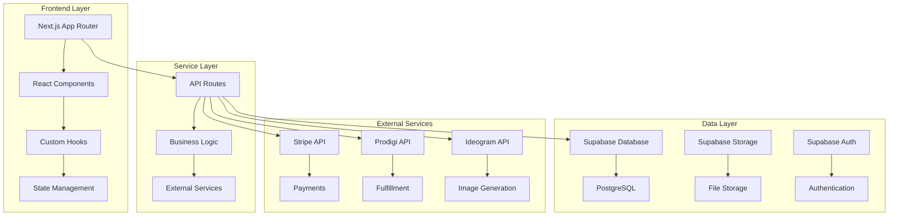
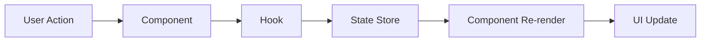
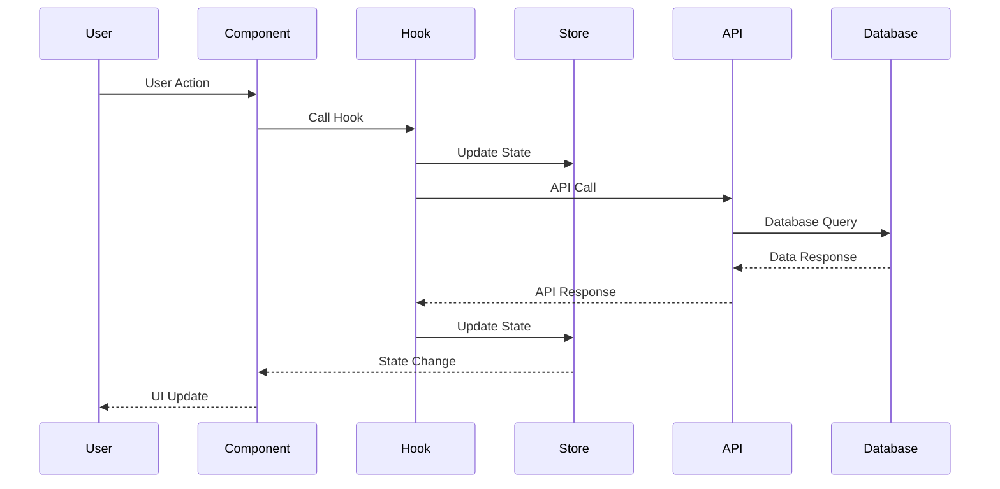
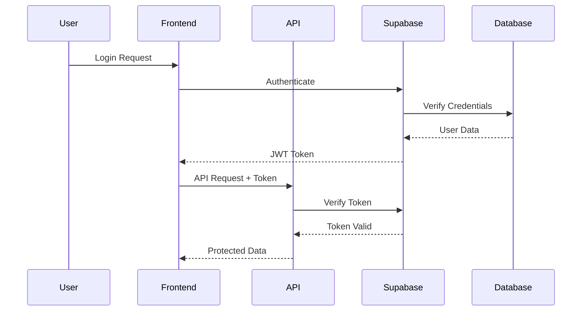
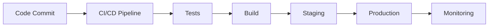

# 🏗️ **ART FRAMER - ARCHITECTURE DOCUMENTATION**

## 📋 **Table of Contents**

1. [System Overview](#system-overview)
2. [Architecture Patterns](#architecture-patterns)
3. [Component Architecture](#component-architecture)
4. [State Management](#state-management)
5. [Data Flow](#data-flow)
6. [API Architecture](#api-architecture)
7. [Security Architecture](#security-architecture)
8. [Performance Architecture](#performance-architecture)

## 🎯 **System Overview**

### **High-Level Architecture**



### **Technology Stack**

- **Frontend**: Next.js 14, React 18, TypeScript
- **Styling**: Tailwind CSS, Framer Motion
- **State Management**: Zustand, React Context
- **Database**: Supabase (PostgreSQL)
- **Authentication**: Supabase Auth
- **Payments**: Stripe
- **Fulfillment**: Prodigi API
- **Image Generation**: Ideogram API

## 🏛️ **Architecture Patterns**

### **1. Layered Architecture**

```
┌─────────────────────────────────────┐
│           Presentation Layer         │
│  (Components, Pages, UI Logic)      │
├─────────────────────────────────────┤
│           Application Layer          │
│  (Hooks, Business Logic, State)     │
├─────────────────────────────────────┤
│           Service Layer              │
│  (API Routes, External Services)    │
├─────────────────────────────────────┤
│           Data Layer                 │
│  (Database, Storage, Cache)         │
└─────────────────────────────────────┘
```

### **2. Component Composition Pattern**

```typescript
// Base Component
interface BaseComponentProps {
  children?: React.ReactNode;
  className?: string;
}

// Feature Component
interface FeatureComponentProps extends BaseComponentProps {
  feature: string;
  onAction: () => void;
}

// Composed Component
const ComposedComponent = ({ feature, onAction, ...props }: FeatureComponentProps) => {
  return (
    <BaseComponent {...props}>
      <FeatureComponent feature={feature} onAction={onAction} />
    </BaseComponent>
  );
};
```

### **3. Hook Composition Pattern**

```typescript
// Base Hook
const useBaseFeature = () => {
  const [state, setState] = useState();
  return { state, setState };
};

// Composed Hook
const useComposedFeature = () => {
  const base = useBaseFeature();
  const additional = useAdditionalFeature();

  return {
    ...base,
    ...additional,
  };
};
```

## 🧩 **Component Architecture**

### **Component Hierarchy**

```
App
├── Layout
│   ├── Header
│   ├── Sidebar
│   └── Main
├── Pages
│   ├── Home
│   ├── Gallery
│   ├── Generation
│   └── Checkout
└── Features
    ├── Auth
    ├── Cart
    ├── Generation
    └── Orders
```

### **Component Types**

#### **1. UI Components (Atomic)**

```typescript
// Button Component
interface ButtonProps {
  variant: "primary" | "secondary" | "danger";
  size: "sm" | "md" | "lg";
  loading?: boolean;
  disabled?: boolean;
  onClick?: () => void;
  children: React.ReactNode;
}

export const Button: React.FC<ButtonProps> = ({
  variant,
  size,
  loading,
  disabled,
  onClick,
  children,
}) => {
  // Implementation
};
```

#### **2. Feature Components**

```typescript
// Generation Panel
interface GenerationPanelProps {
  isOpen: boolean;
  onClose: () => void;
  onGenerate: (prompt: string) => void;
}

export const GenerationPanel: React.FC<GenerationPanelProps> = ({
  isOpen,
  onClose,
  onGenerate,
}) => {
  // Implementation
};
```

#### **3. Page Components**

```typescript
// Home Page
export default function HomePage() {
  return (
    <Layout>
      <HeroSection />
      <FeaturedGallery />
      <GenerationSection />
    </Layout>
  );
}
```

## 🔄 **State Management**

### **State Architecture**

```typescript
// Global State (Zustand)
interface AppState {
  // Auth State
  user: User | null;
  isAuthenticated: boolean;

  // UI State
  theme: "light" | "dark";
  sidebarOpen: boolean;

  // Business State
  cart: CartItem[];
  generation: GenerationState;

  // Actions
  setUser: (user: User | null) => void;
  toggleSidebar: () => void;
  addToCart: (item: CartItem) => void;
}

// Local State (React Hooks)
const useLocalState = () => {
  const [loading, setLoading] = useState(false);
  const [error, setError] = useState<string | null>(null);

  return { loading, setLoading, error, setError };
};
```

### **State Flow**



## 📊 **Data Flow**

### **Data Flow Architecture**



### **Data Fetching Patterns**

```typescript
// 1. React Query Pattern
const useImageGeneration = (prompt: string) => {
  return useQuery({
    queryKey: ["image-generation", prompt],
    queryFn: () => generateImage(prompt),
    enabled: !!prompt,
    retry: 3,
    retryDelay: 1000,
  });
};

// 2. SWR Pattern
const useUserProfile = (userId: string) => {
  const { data, error, mutate } = useSWR(
    userId ? `/api/users/${userId}` : null,
    fetcher
  );

  return { profile: data, error, mutate };
};

// 3. Custom Hook Pattern
const useAuth = () => {
  const [user, setUser] = useState<User | null>(null);
  const [loading, setLoading] = useState(true);

  useEffect(() => {
    // Auth logic
  }, []);

  return { user, loading, login, logout };
};
```

## 🔌 **API Architecture**

### **API Layer Structure**

```
src/app/api/
├── auth/
│   ├── login/route.ts
│   ├── logout/route.ts
│   └── refresh/route.ts
├── images/
│   ├── generate/route.ts
│   ├── save/route.ts
│   └── proxy/route.ts
├── orders/
│   ├── create/route.ts
│   ├── status/route.ts
│   └── history/route.ts
└── webhooks/
    ├── stripe/route.ts
    └── prodigi/route.ts
```

### **API Response Standards**

```typescript
// Success Response
interface ApiSuccessResponse<T> {
  success: true;
  data: T;
  message?: string;
  timestamp: string;
}

// Error Response
interface ApiErrorResponse {
  success: false;
  error: {
    code: string;
    message: string;
    details?: any;
  };
  timestamp: string;
}

// API Route Example
export async function POST(request: Request): Promise<Response> {
  try {
    const data = await request.json();
    const result = await processData(data);

    return NextResponse.json({
      success: true,
      data: result,
      timestamp: new Date().toISOString(),
    });
  } catch (error) {
    return NextResponse.json(
      {
        success: false,
        error: {
          code: "INTERNAL_ERROR",
          message: error instanceof Error ? error.message : "Unknown error",
        },
        timestamp: new Date().toISOString(),
      },
      { status: 500 }
    );
  }
}
```

## 🔒 **Security Architecture**

### **Authentication Flow**



### **Security Layers**

1. **Frontend Security**
   - Input validation
   - XSS prevention
   - CSRF protection

2. **API Security**
   - JWT validation
   - Rate limiting
   - Input sanitization

3. **Database Security**
   - Row Level Security (RLS)
   - Encrypted connections
   - Audit logging

## ⚡ **Performance Architecture**

### **Performance Optimization Strategy**

```typescript
// 1. Code Splitting
const LazyComponent = lazy(() => import('./LazyComponent'));

// 2. Image Optimization
const OptimizedImage = ({ src, alt, ...props }) => {
  return (
    <Image
      src={src}
      alt={alt}
      width={500}
      height={300}
      loading="lazy"
      placeholder="blur"
      blurDataURL="data:image/jpeg;base64,..."
      {...props}
    />
  );
};

// 3. Memoization
const MemoizedComponent = memo(({ data }) => {
  return <div>{data}</div>;
});

// 4. Virtual Scrolling
const VirtualizedList = ({ items, renderItem }) => {
  // Implementation for large lists
};
```

### **Caching Strategy**

```typescript
// 1. API Caching
const useCachedData = (key: string, fetcher: () => Promise<any>) => {
  return useSWR(key, fetcher, {
    revalidateOnFocus: false,
    revalidateOnReconnect: true,
    dedupingInterval: 60000, // 1 minute
  });
};

// 2. Component Caching
const CachedComponent = memo(({ data }) => {
  return <div>{data}</div>;
});

// 3. Image Caching
const CachedImage = ({ src, alt }) => {
  return (
    <Image
      src={src}
      alt={alt}
      priority={false}
      loading="lazy"
      cache="force-cache"
    />
  );
};
```

## 🧪 **Testing Architecture**

### **Testing Pyramid**

```
        E2E Tests
       /         \
      /           \
     /             \
    /               \
   /                 \
  /                   \
 /                     \
/                       \
Integration Tests
/                       \
/                         \
/                           \
/                             \
/                               \
/                                 \
Unit Tests
```

### **Testing Strategy**

```typescript
// 1. Unit Tests
describe('Utility Functions', () => {
  it('should format date correctly', () => {
    expect(formatDate('2025-01-15')).toBe('Jan 15, 2025');
  });
});

// 2. Component Tests
describe('Button Component', () => {
  it('should render with correct props', () => {
    render(<Button variant="primary">Click me</Button>);
    expect(screen.getByRole('button')).toBeInTheDocument();
  });
});

// 3. Integration Tests
describe('User Authentication Flow', () => {
  it('should complete login process', async () => {
    // Test complete login flow
  });
});

// 4. E2E Tests
describe('Complete User Journey', () => {
  it('should generate image and add to cart', async () => {
    // Test complete user journey
  });
});
```

## 📈 **Monitoring Architecture**

### **Monitoring Stack**

```typescript
// 1. Error Tracking
const ErrorTracker = {
  captureException: (error: Error, context?: any) => {
    // Send to Sentry
  },
  captureMessage: (message: string, level: "info" | "warning" | "error") => {
    // Send to Sentry
  },
};

// 2. Performance Monitoring
const PerformanceTracker = {
  measure: (name: string, fn: () => void) => {
    const start = performance.now();
    fn();
    const end = performance.now();
    console.log(`${name} took ${end - start} milliseconds`);
  },
};

// 3. User Analytics
const Analytics = {
  track: (event: string, properties?: any) => {
    // Send to analytics service
  },
  identify: (userId: string, traits?: any) => {
    // Identify user
  },
};
```

## 🚀 **Deployment Architecture**

### **Deployment Pipeline**



### **Environment Configuration**

```typescript
// Environment-specific configs
const config = {
  development: {
    apiUrl: process.env.NEXT_PUBLIC_API_URL_DEV,
    debug: true,
    logLevel: "debug",
  },
  staging: {
    apiUrl: process.env.NEXT_PUBLIC_API_URL_STAGING,
    debug: true,
    logLevel: "info",
  },
  production: {
    apiUrl: process.env.NEXT_PUBLIC_API_URL_PROD,
    debug: false,
    logLevel: "error",
  },
};
```

---

## 📝 **Quick Reference**

### **Architecture Decisions**

- **State Management**: Zustand for global state, React hooks for local state
- **Data Fetching**: React Query for server state, SWR for caching
- **Styling**: Tailwind CSS for utility-first styling
- **Testing**: Jest + React Testing Library + Playwright
- **Monitoring**: Sentry for error tracking, Analytics for user behavior

### **Key Principles**

1. **Separation of Concerns**: Clear boundaries between layers
2. **Single Responsibility**: Each component has one purpose
3. **Composition over Inheritance**: Build complex components from simple ones
4. **Performance First**: Optimize for speed and user experience
5. **Security by Design**: Security considerations in every layer

---

**Last Updated**: January 2025
**Version**: 1.0.0
**Maintainer**: Development Team
