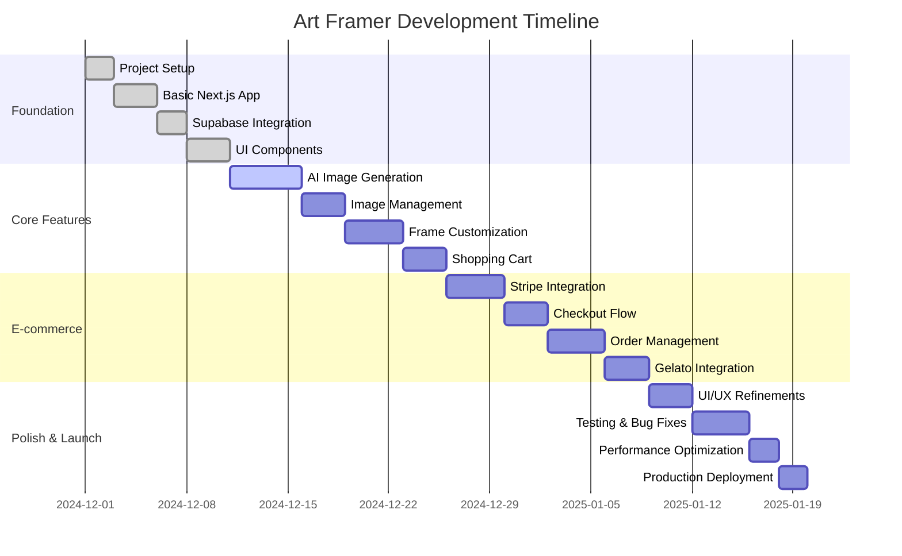

# Art Framer - Development Roadmap

## 🗺️ Development Phases Overview



## 📋 Phase 1: Foundation (Week 1-2)

### Week 1: Project Setup & Basic Structure

#### Day 1-2: Project Initialization

- [ ] **Initialize Next.js 14 project with TypeScript**
  ```bash
  npx create-next-app@latest art-framer --typescript --tailwind --app --src-dir
  cd art-framer
  ```
- [ ] **Set up development environment**
  - Install VS Code extensions
  - Configure ESLint and Prettier
  - Set up Git repository
- [ ] **Configure Tailwind CSS with custom design system**
  - Create color palette
  - Define typography scale
  - Set up component variants

#### Day 3-4: Supabase Integration

- [ ] **Set up Supabase project**
  - Create new Supabase project
  - Configure database schema
  - Set up Row Level Security (RLS)
- [ ] **Install and configure Supabase client**
  ```bash
  npm install @supabase/supabase-js @supabase/auth-helpers-nextjs
  ```
- [ ] **Create database connection utilities**
  - Set up environment variables
  - Create Supabase client configuration
  - Add TypeScript types
- [ ] **Configure Supabase Storage**
  - Create storage bucket for images
  - Set up storage policies and permissions
  - Configure CDN and optimization settings
  - Test upload/download functionality

#### Day 5-7: UI Component Library

- [ ] **Install and configure UI libraries**
  ```bash
  npm install @radix-ui/react-dialog @radix-ui/react-select @radix-ui/react-button
  npm install class-variance-authority clsx tailwind-merge
  npm install framer-motion
  ```
- [ ] **Create base UI components**
  - Button component with variants
  - Input and form components
  - Modal and dialog components
  - Loading states and animations

### Week 2: Core Infrastructure

#### Day 8-10: Authentication System

- [ ] **Implement Supabase Auth**
  - Set up authentication middleware
  - Create login/register pages
  - Implement protected routes
  - Add user context provider
- [ ] **Create auth utilities**
  ```typescript
  // lib/auth.ts
  export class AuthService {
    async signUp(email: string, password: string);
    async signIn(email: string, password: string);
    async signOut();
    async getCurrentUser();
  }
  ```

#### Day 11-12: Basic Layout & Navigation

- [ ] **Create main layout components**
  - Header with navigation
  - Footer
  - Main content wrapper
- [ ] **Implement responsive navigation**
  - Mobile menu
  - User account dropdown
  - Shopping cart indicator

#### Day 13-14: Landing Page

- [ ] **Design and implement landing page**
  - Hero section with AI art generator
  - Features showcase
  - How it works section
  - Call-to-action buttons
- [ ] **Add animations and interactions**
  - Smooth scroll effects
  - Hover animations
  - Loading states

## 🎨 Phase 2: Core Features (Week 3-4)

### Week 3: AI Image Generation

#### Day 15-17: AI Integration Setup

- [ ] **Set up AI image generation APIs**
  - Configure Ideogram API client
  - Set up Veo API as backup
  - Create API rate limiting
- [ ] **Create image generation service**
  ```typescript
  // lib/ai-image.ts
  export class AIImageService {
    async generateImage(prompt: string, style?: string);
    async generateVariations(imageId: string);
    async upscaleImage(imageUrl: string);
  }
  ```

#### Day 18-19: Image Generation UI

- [ ] **Create AI prompt interface**
  - Text input with character limit
  - Style selection dropdown
  - Size options
  - Generate button with loading state
- [ ] **Implement real-time generation**
  - Progress indicators
  - Error handling
  - Retry functionality

#### Day 20-21: Image Display & Management

- [ ] **Create image display components**
  - Full-size image viewer
  - Thumbnail gallery
  - Image metadata display
- [ ] **Implement Supabase Storage**
  - Set up storage bucket and policies
  - Create storage service with upload/download
  - Implement image processing pipeline
  - Generate thumbnails and optimized versions
  - Handle image optimization and CDN delivery

### Week 4: Product Customization

#### Day 22-24: Frame Customization

- [ ] **Create frame selection interface**
  - Frame size options (Small, Medium, Large)
  - Frame style options (Black, White, Natural)
  - Real-time preview
- [ ] **Implement pricing logic**
  - Dynamic pricing based on size
  - Tax calculation
  - Shipping estimates
- [ ] **Add frame preview functionality**
  - Overlay frame on generated image
  - Multiple angle views
  - Zoom and pan controls

#### Day 25-26: Shopping Cart

- [ ] **Implement cart functionality**
  - Add to cart functionality
  - Cart state management with Zustand
  - Quantity adjustments
  - Remove items
- [ ] **Create cart UI components**
  - Cart sidebar/drawer
  - Cart item cards
  - Price summary
  - Checkout button

#### Day 27-28: User Experience Polish

- [ ] **Add smooth transitions**
  - Page transitions
  - Component animations
  - Loading states
- [ ] **Implement error handling**
  - User-friendly error messages
  - Retry mechanisms
  - Fallback states

## 💳 Phase 3: E-commerce (Week 5-6)

### Week 5: Payment Integration

#### Day 29-31: Stripe Setup

- [ ] **Configure Stripe**
  - Set up Stripe account
  - Install Stripe SDK
  - Configure webhooks
- [ ] **Create payment utilities**
  ```typescript
  // lib/stripe.ts
  export async function createPaymentIntent(amount: number);
  export async function createCheckoutSession(params: CheckoutParams);
  export async function handleWebhook(event: Stripe.Event);
  ```

#### Day 32-33: Checkout Flow

- [ ] **Implement checkout process**
  - Shipping address form
  - Billing information
  - Payment method selection
  - Order summary
- [ ] **Add form validation**
  - Address validation
  - Credit card validation
  - Error handling

#### Day 34-35: Order Management

- [ ] **Create order processing**
  - Order creation in database
  - Payment confirmation
  - Order status tracking
- [ ] **Implement order confirmation**
  - Confirmation emails
  - Order details page
  - Tracking information

### Week 6: Dropshipping Integration

#### Day 36-38: Gelato Integration

- [ ] **Set up Gelato API**
  - Configure API credentials
  - Create product mappings
  - Test API endpoints
- [ ] **Implement order routing**
  ```typescript
  // lib/gelato.ts
  export class GelatoService {
    async createOrder(orderData: OrderData);
    async getOrderStatus(orderId: string);
    async getTrackingInfo(orderId: string);
  }
  ```

#### Day 39-40: Order Fulfillment

- [ ] **Create fulfillment workflow**
  - Automatic order routing to Gelato
  - Order status synchronization
  - Tracking number updates
- [ ] **Implement notification system**
  - Order confirmation emails
  - Shipping notifications
  - Delivery confirmations

#### Day 41-42: Admin Dashboard

- [ ] **Create admin interface**
  - Order management dashboard
  - Customer information
  - Sales analytics
  - Inventory tracking (for monitoring)

## 🚀 Phase 4: Polish & Launch (Week 7-8)

### Week 7: Testing & Optimization

#### Day 43-45: Comprehensive Testing

- [ ] **Unit testing**
  - API route testing
  - Component testing
  - Utility function testing
- [ ] **Integration testing**
  - End-to-end user flows
  - Payment processing
  - Order fulfillment
- [ ] **Performance testing**
  - Load testing
  - Image generation speed
  - Database query optimization

#### Day 46-47: Bug Fixes & Refinements

- [ ] **Fix identified issues**
  - UI/UX improvements
  - Performance optimizations
  - Security enhancements
- [ ] **Add final polish**
  - Micro-interactions
  - Accessibility improvements
  - Mobile responsiveness

### Week 8: Launch Preparation

#### Day 48-50: Production Setup

- [ ] **Configure production environment**
  - Set up Vercel deployment
  - Configure production databases
  - Set up monitoring and analytics
- [ ] **Security audit**
  - API security review
  - Data protection compliance
  - Payment security validation

#### Day 51-52: Soft Launch

- [ ] **Internal testing**
  - Team testing
  - Friends and family testing
  - Bug reporting and fixes
- [ ] **Performance monitoring**
  - Set up error tracking
  - Monitor key metrics
  - Optimize based on data

#### Day 53-56: Public Launch

- [ ] **Go live**
  - Domain configuration
  - SSL certificate setup
  - DNS configuration
- [ ] **Marketing launch**
  - Social media announcements
  - Press releases
  - Influencer outreach

## 📊 Success Metrics & KPIs

### Technical Metrics

- **Page Load Time**: <3 seconds
- **Image Generation Speed**: <30 seconds
- **API Response Time**: <500ms
- **Uptime**: >99.9%
- **Error Rate**: <1%

### Business Metrics

- **Conversion Rate**: >5% (prompt to purchase)
- **Average Order Value**: $45-85
- **Customer Acquisition Cost**: <$20
- **Customer Lifetime Value**: >$150
- **Return Customer Rate**: >30%

### User Experience Metrics

- **Time to First Image**: <2 minutes
- **Cart Abandonment Rate**: <25%
- **User Satisfaction Score**: >4.5/5
- **Mobile Usage**: >60%

## 🛠️ Development Tools & Resources

### Essential Tools

- **Code Editor**: VS Code with extensions
- **Version Control**: Git with GitHub
- **Design**: Figma for UI/UX design
- **API Testing**: Postman or Insomnia
- **Database**: Supabase Dashboard

### Development Resources

- **Documentation**: Next.js, Supabase, Stripe docs
- **UI Libraries**: Radix UI, Tailwind CSS
- **Testing**: Jest, React Testing Library
- **Deployment**: Vercel
- **Monitoring**: Sentry, Vercel Analytics

## 🚨 Risk Mitigation

### Technical Risks

- **AI API Downtime**: Implement multiple providers
- **Payment Failures**: Robust error handling and retry logic
- **Performance Issues**: Regular monitoring and optimization

### Business Risks

- **Competition**: Focus on superior UX and faster generation
- **Market Changes**: Flexible architecture for quick pivots
- **Regulatory Issues**: Compliance-first approach

## 📝 Daily Development Checklist

### Before Starting Each Day

- [ ] Review yesterday's progress
- [ ] Check for any blocking issues
- [ ] Update project status
- [ ] Plan today's tasks

### During Development

- [ ] Write clean, documented code
- [ ] Test functionality as you build
- [ ] Commit code frequently
- [ ] Update documentation

### End of Day

- [ ] Test all new features
- [ ] Commit and push code
- [ ] Update progress tracking
- [ ] Plan tomorrow's tasks

## 🎯 Milestone Deliverables

### Week 2 Deliverable: MVP Foundation

- [ ] Working Next.js app with Supabase
- [ ] Basic authentication system
- [ ] Landing page with navigation
- [ ] UI component library

### Week 4 Deliverable: Core Functionality

- [ ] AI image generation working
- [ ] Frame customization interface
- [ ] Shopping cart functionality
- [ ] Basic user flows complete

### Week 6 Deliverable: E-commerce Ready

- [ ] Payment processing working
- [ ] Order management system
- [ ] Dropshipping integration
- [ ] Admin dashboard

### Week 8 Deliverable: Production Ready

- [ ] Fully tested application
- [ ] Performance optimized
- [ ] Security audited
- [ ] Ready for public launch

---

**Document Version**: 1.0  
**Last Updated**: December 2024  
**Next Review**: Weekly during development
