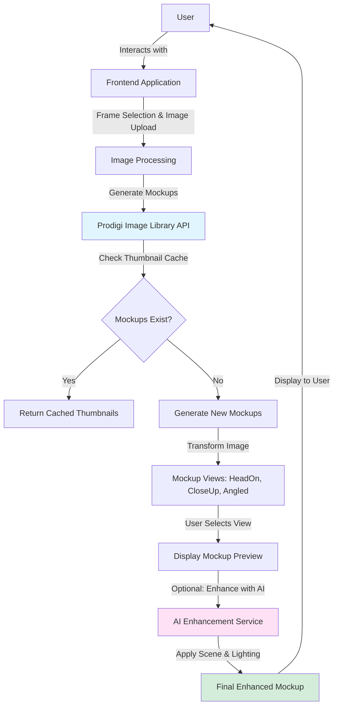
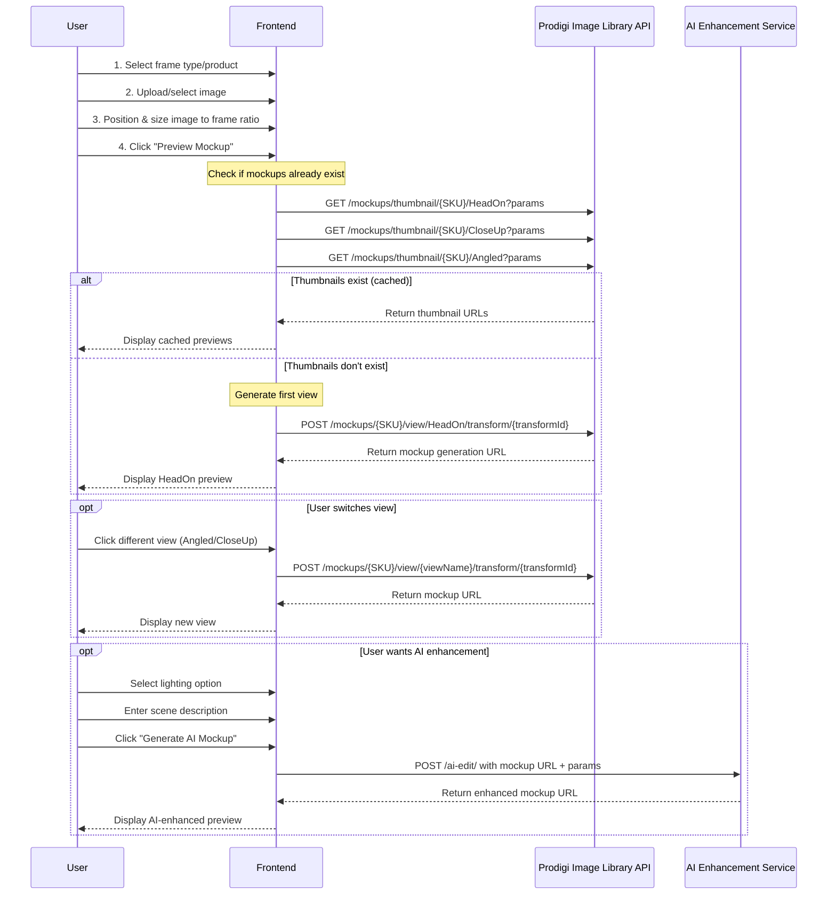
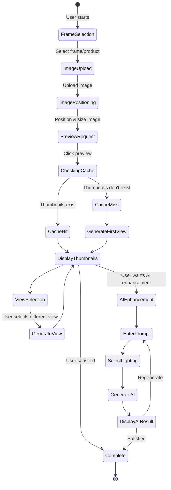
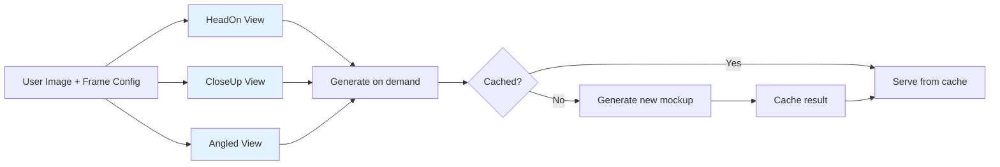
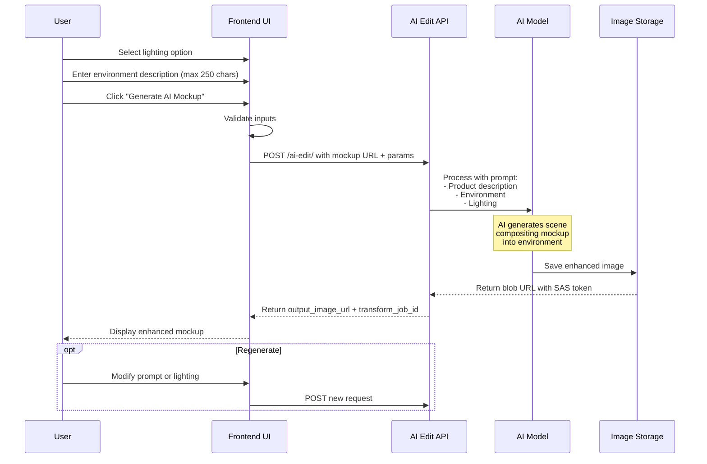
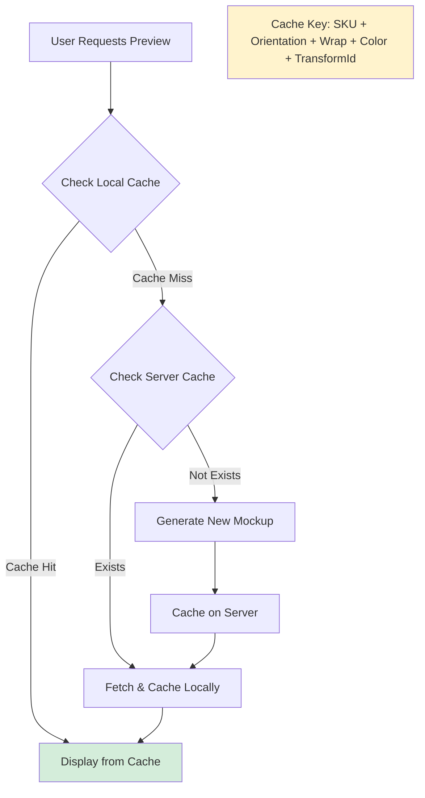
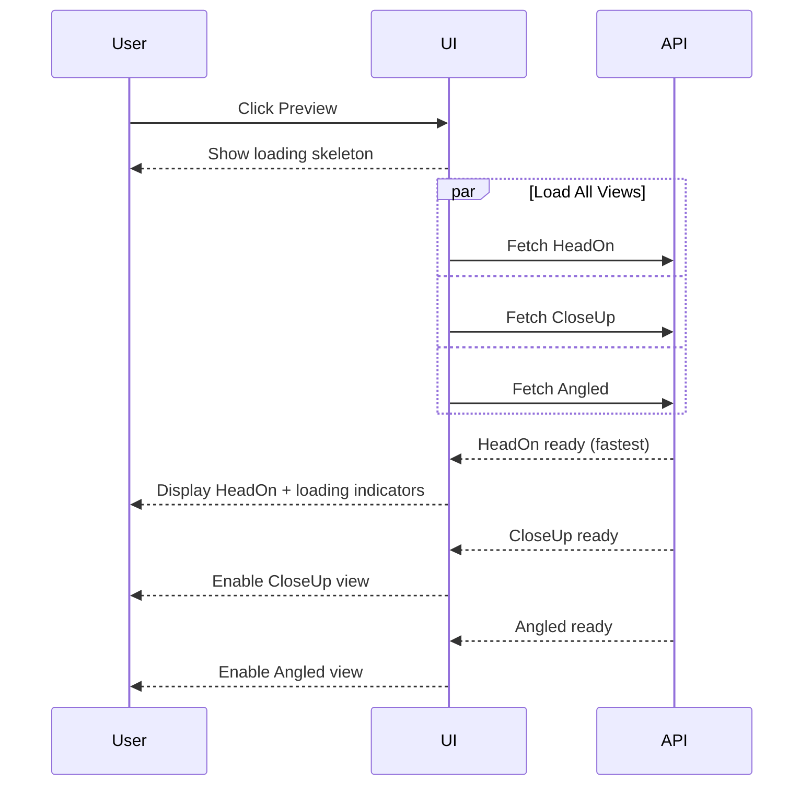
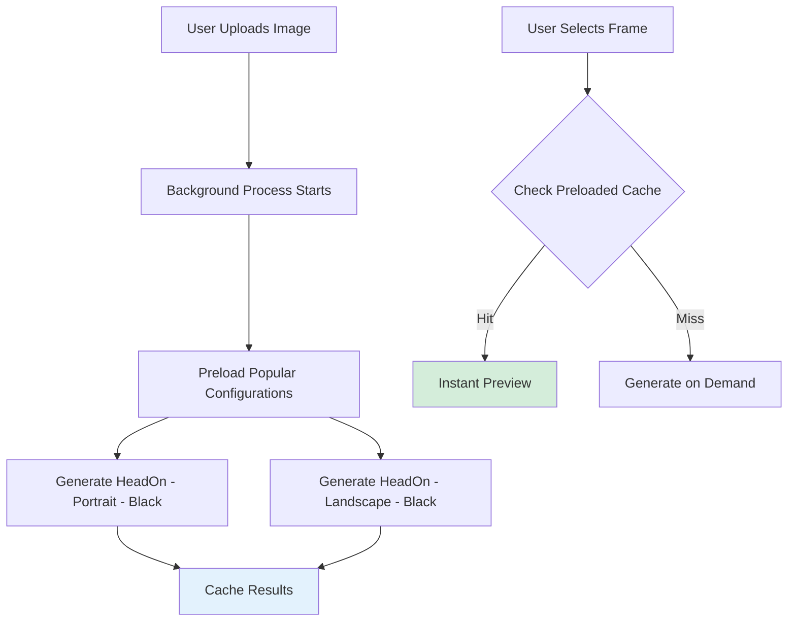
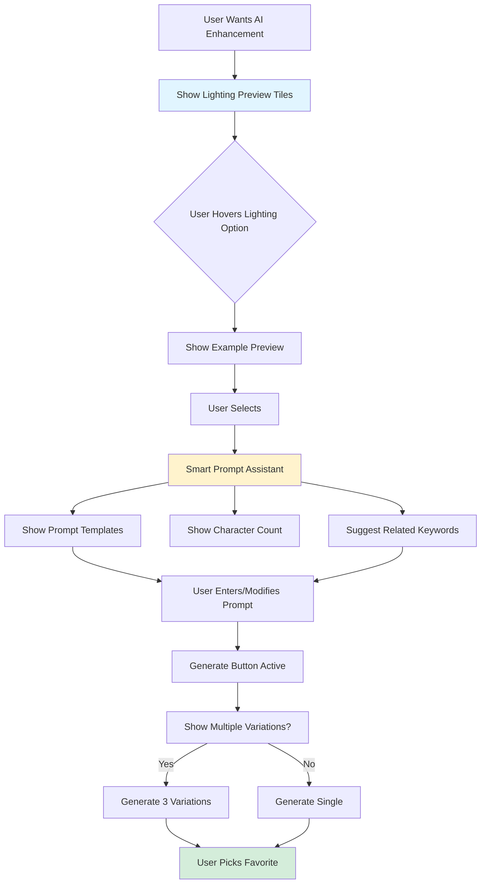
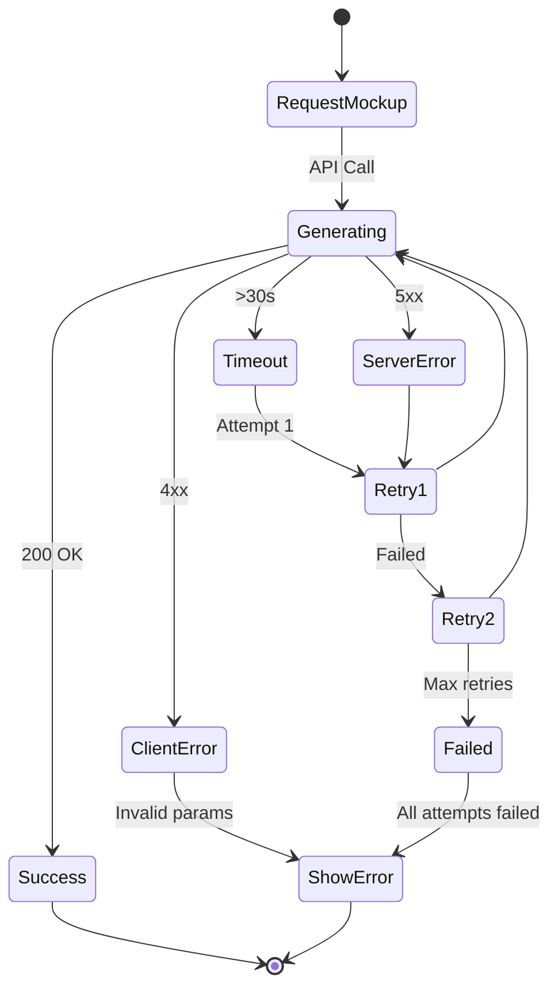

# Prodigi AI Mockup System Documentation

## Overview

This document explains how the Prodigi AI mockup tool works, detailing the complete workflow from frame selection to AI-enhanced preview generation. This documentation will serve as a reference for future improvements to the frame preview user experience.

## Table of Contents

1. [System Architecture](#system-architecture)
2. [Workflow Sequence](#workflow-sequence)
3. [API Endpoints](#api-endpoints)
4. [Mockup Generation Process](#mockup-generation-process)
5. [AI Enhancement Features](#ai-enhancement-features)
6. [Future Improvements](#future-improvements)

---

## System Architecture

The Prodigi mockup system consists of three main components:

1. **Frontend Application**: Handles user interactions and orchestrates API calls
2. **Prodigi Image Library API**: Generates and serves mockup images
3. **AI Enhancement Service**: Creates realistic scene compositions with custom lighting

### High-Level Architecture



---

## Workflow Sequence

### Complete User Flow



---

## API Endpoints

### 1. Thumbnail Check Endpoint

**Purpose**: Check if mockup previews already exist (cached)

```
GET https://live-services.pwinty.com/image-library/mockups/thumbnail/{SKU}/{ViewName}
```

**Parameters**:
- `SKU`: Product SKU (e.g., `GLOBAL-FRA-CAN-10x12`)
- `ViewName`: `HeadOn`, `CloseUp`, or `Angled`
- Query params:
  - `orientation`: `PORTRAIT` or `LANDSCAPE`
  - `wrap`: Frame wrap color (e.g., `BLACK`)
  - `color`: Frame color (e.g., `BLACK`)

**Example**:
```bash
GET /mockups/thumbnail/GLOBAL-FRA-CAN-10x12/HeadOn?orientation=PORTRAIT&wrap=BLACK&color=BLACK&
```

**Response**:
- If exists: Returns thumbnail image
- If not exists: 404 or empty response

---

### 2. Mockup Generation Endpoint

**Purpose**: Generate a new mockup view with the user's image

```
POST https://live-services.pwinty.com/image-library/mockups/{SKU}/view/{ViewName}/transform/{transformId}
```

**Parameters**:
- `SKU`: Product SKU
- `ViewName`: View angle (`HeadOn`, `CloseUp`, `Angled`)
- `transformId`: Unique transform identifier for the image positioning

**Request Body**:
```json
{
  "view_name": "HeadOn",
  "variants": {
    "wrap": "BLACK",
    "color": "BLACK",
    "orientation": "PORTRAIT"
  }
}
```

**Response**:
```json
{
  "url": "https://live-services.pwinty.com/image-library/render_mockup/GLOBAL-FRA-CAN-10x12/view/HeadOn/transform/691db8c4848657bbc781f302?orientation=PORTRAIT&wrap=BLACK&color=BLACK&blank=False&transparent=False&preview=False&access_token=..."
}
```

---

### 3. AI Enhancement Endpoint

**Purpose**: Apply AI-generated backgrounds and lighting to mockup

```
POST https://live-services.pwinty.com/image-library/mockups/ai-edit/
```

**Request Body**:
```json
{
  "source_image_url": "https://live-services.pwinty.com/image-library/render_mockup/...",
  "edit_params": {
    "environment": "Minimalist modern living room interior, soft beige walls, natural morning, wooden floor, neutral tones, clean Scandinavian design",
    "lighting": "Golden hour (emotional, premium feel)",
    "product_description": "Global float framed canvas on premium stretcher bars, 10x12\" / 25x31cm."
  }
}
```

**Response**:
```json
{
  "source_image_url": "https://...",
  "output_image_url": "https://imagelibraryimagessalive.blob.core.windows.net/ai-edits/ai-edit-8f32840e-f649-40cb-a5ff-9f48ea77cce2.jpg?...",
  "transform": {
    "product_description": "Global float framed canvas on premium stretcher bars, 10x12\" / 25x31cm.",
    "environment": "Minimalist modern living room interior...",
    "lighting": "Golden hour (emotional, premium feel)"
  },
  "transform_job_id": "18363915-856a-4fe0-9ca5-e03d4e1a7ea9",
  "extraData": {}
}
```

---

## Mockup Generation Process

### State Diagram



### Mockup Views

The system generates three different viewing angles:

1. **HeadOn**: Front-facing view
2. **CloseUp**: Close-up detail view
3. **Angled**: 3D angled perspective



---

## AI Enhancement Features

### Available Lighting Options

The AI enhancement service supports various lighting scenarios to create realistic and emotionally engaging mockups:

1. **Soft daylight (natural light)** - Clean, natural illumination
2. **Golden hour (emotional, premium feel)** - Warm, sunset-inspired lighting
3. **Blue hour (emotional, sophisticated vibe)** - Cool, twilight atmosphere
4. **Candlelit (warm, intimate)** - Cozy, intimate setting
5. **Spotlight contrast (bold, dramatic focus)** - High-contrast, dramatic effect

### Environment Prompt Guidelines

**Character Limit**: 250 characters

**Example Prompts**:
- "Minimalist modern living room interior, soft beige walls, natural morning, wooden floor, neutral tones, clean Scandinavian design"
- "Luxury bedroom with dark walls, elegant bedside table, ambient lighting, sophisticated contemporary style"
- "Bright home office with white walls, wooden desk, plants, natural window light, clean professional space"

**Best Practices**:
- Be specific about room type and style
- Mention color palette and materials
- Include lighting context (natural, ambient, etc.)
- Describe atmosphere and mood
- Keep within character limit

### AI Processing Flow



### Transform Job Tracking

Each AI enhancement request generates a unique `transform_job_id` that can be used to:
- Track processing status
- Cache results
- Allow regeneration with modifications
- Link related transformations

---

## Future Improvements

### 1. Caching Strategy

**Current Behavior**:
- Thumbnail check happens on every preview request
- No client-side caching of mockup URLs
- Multiple API calls for same configuration

**Proposed Improvements**:


**Implementation**:
- Use browser localStorage/sessionStorage for mockup URLs
- Implement cache key based on: `${SKU}_${orientation}_${wrap}_${color}_${transformId}`
- Set reasonable TTL (Time To Live) for cached entries
- Clear cache when user modifies image positioning

---

### 2. Progressive Loading

**Enhanced UX Flow**:



**Benefits**:
- Faster perceived performance
- Users see first view quickly
- Other views load in background
- Better user feedback with loading states

---

### 3. Preloading Strategy

**Predictive Loading**:



---

### 4. AI Enhancement UX Improvements

**Current Limitations**:
- No preview of lighting options
- Users can't see what prompts work best
- No prompt suggestions
- Single generation per request

**Proposed Enhancements**:



**Features to Add**:
1. **Lighting Preview Tiles**: Show sample images for each lighting option
2. **Prompt Templates**: Predefined prompts for common scenarios
3. **Prompt Suggestions**: AI-powered keyword suggestions
4. **Character Counter**: Visual feedback (129/250)
5. **Multiple Variations**: Generate 2-3 variations per request
6. **History**: Save previously used prompts
7. **Favorites**: Allow users to favorite successful combinations

---

### 5. Performance Optimization

**Batch Request Strategy**:

```javascript
// Current: Sequential requests
await fetch(thumbnailHeadOn);
await fetch(thumbnailCloseUp);
await fetch(thumbnailAngled);

// Proposed: Parallel requests
const [headOn, closeUp, angled] = await Promise.all([
  fetch(thumbnailHeadOn),
  fetch(thumbnailCloseUp),
  fetch(thumbnailAngled)
]);
```

**Image Optimization**:
- Request lower resolution for thumbnails
- Use progressive JPEG loading
- Implement lazy loading for non-visible views
- Compress images before upload

---

### 6. Error Handling & Retry Logic



**Implementation**:
- Exponential backoff for retries
- Clear error messages for users
- Fallback to cached version if available
- Network status indicators

---

### 7. Enhanced Preview Modal

**Proposed Layout**:

```
┌─────────────────────────────────────────────────────┐
│  Preview Mockup                              [X]    │
├─────────────────────────────────────────────────────┤
│                                                     │
│  ┌─────────────────────────────────────────────┐   │
│  │                                             │   │
│  │         [Main Mockup Preview]               │   │
│  │                                             │   │
│  │              [Loading...]                   │   │
│  │                                             │   │
│  └─────────────────────────────────────────────┘   │
│                                                     │
│  View Angles:                                       │
│  [ HeadOn* ] [ CloseUp ] [ Angled ]                │
│                                                     │
│  ┌─ AI Enhancement ────────────────────────────┐   │
│  │                                             │   │
│  │  Lighting: [Golden hour ▼]  [Preview]      │   │
│  │                                             │   │
│  │  Environment Description: (142/250)         │   │
│  │  ┌─────────────────────────────────────┐   │   │
│  │  │ Minimalist modern living room...    │   │   │
│  │  └─────────────────────────────────────┘   │   │
│  │                                             │   │
│  │  [Prompt Templates ▼]  [Generate AI ✨]    │   │
│  │                                             │   │
│  └─────────────────────────────────────────────┘   │
│                                                     │
│  [ Add to Cart ]              [ Save Preview ]      │
└─────────────────────────────────────────────────────┘
```

---

## Technical Implementation Checklist

### Phase 1: Core Optimization
- [ ] Implement client-side caching for mockup URLs
- [ ] Add parallel thumbnail fetching
- [ ] Implement progressive loading UI
- [ ] Add loading skeletons and spinners

### Phase 2: Enhanced UX
- [ ] Add lighting option preview tiles
- [ ] Implement prompt templates system
- [ ] Add character counter for prompts
- [ ] Create smart prompt suggestions

### Phase 3: Advanced Features
- [ ] Implement multiple variation generation
- [ ] Add prompt history and favorites
- [ ] Create predictive preloading
- [ ] Implement comprehensive error handling

### Phase 4: Performance
- [ ] Add image optimization pipeline
- [ ] Implement CDN caching strategy
- [ ] Add performance monitoring
- [ ] Optimize bundle size

---

## API Authentication

All API requests require Bearer token authentication:

```javascript
headers: {
  'Authorization': 'Bearer {JWT_TOKEN}',
  'Content-Type': 'application/json',
  'Origin': 'https://dashboard.prodigi.com'
}
```

**Token Contains**:
- Merchant ID
- User information
- Permissions (orders, quotes, products)
- Session ID
- Expiration timestamp

---

## Key Considerations

### Transform ID
- Unique identifier for image positioning
- Generated when user positions image in frame
- Used to maintain consistent positioning across views
- Must be included in all mockup generation requests

### Variants
- **Wrap**: Frame edge color (BLACK, WHITE, NATURAL, etc.)
- **Color**: Frame face color
- **Orientation**: PORTRAIT or LANDSCAPE
- Changes to any variant require new mockup generation

### Caching Behavior
- Thumbnails cached server-side
- URL includes access_token with expiration
- Cached mockups tied to specific transform + variant combination
- Changing positioning creates new transform ID

---

## Conclusion

The Prodigi AI mockup system provides a sophisticated pipeline for generating realistic product previews. By understanding this workflow, we can implement targeted improvements that:

1. **Reduce API calls** through intelligent caching
2. **Improve perceived performance** with progressive loading
3. **Enhance user experience** with better prompts and previews
4. **Increase conversion** with higher quality mockups

The proposed improvements focus on maintaining the quality of Prodigi's AI capabilities while optimizing the user journey from frame selection to final preview.

---

## Related Documentation

- [PRODIGI_SETUP.md](./PRODIGI_SETUP.md) - Prodigi API setup and configuration
- [COMPLETE_STRIPE_PRODIGI_INTEGRATION.md](./COMPLETE_STRIPE_PRODIGI_INTEGRATION.md) - Integration guide
- [DYNAMIC_PRODUCT_SYSTEM.md](./DYNAMIC_PRODUCT_SYSTEM.md) - Product configuration system

---

**Last Updated**: November 19, 2025
**Version**: 1.0
**Author**: Development Team

