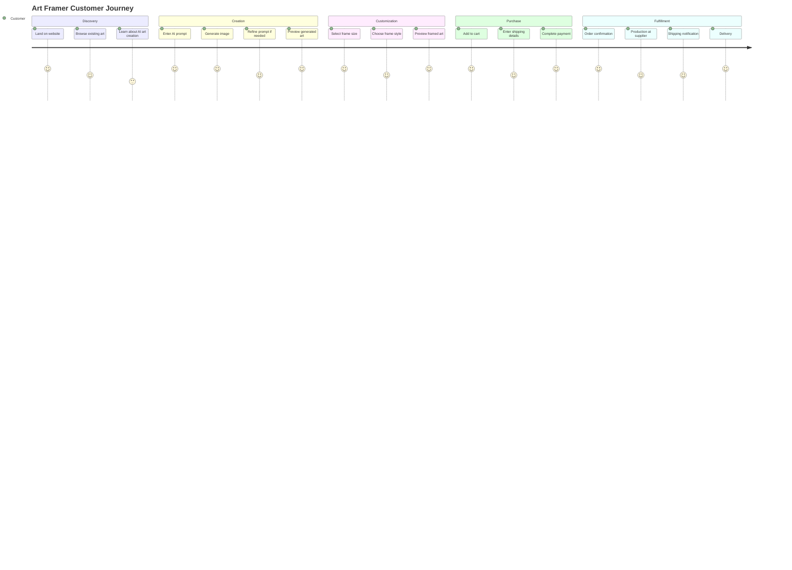
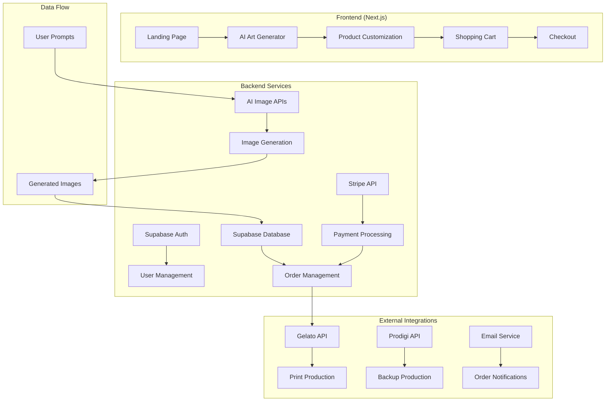
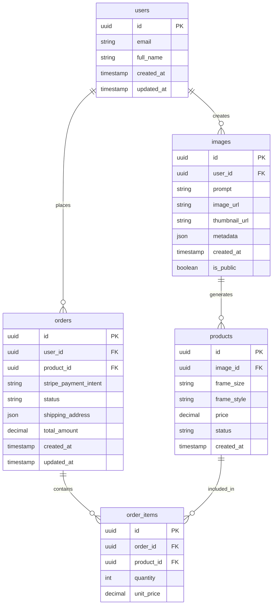
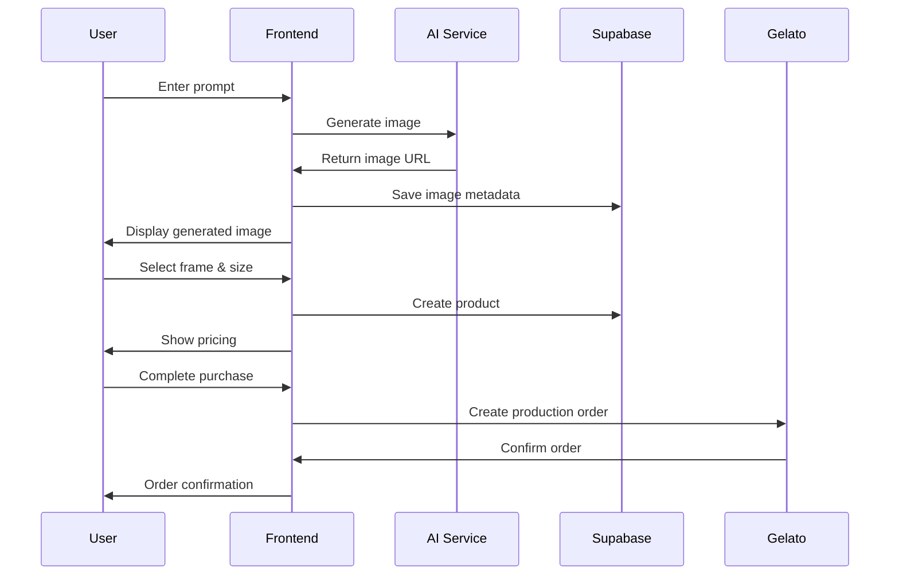

# Art Framer - AI Art E-commerce Platform

## Project Kickoff Document

### 🎯 Project Overview

**Art Framer** is an AI-powered e-commerce platform that allows customers to create custom artwork through AI image generation and purchase it as framed prints delivered to their doorstep. The platform combines the creativity of AI art generation with the convenience of dropshipping to create a seamless end-to-end customer experience.

### 🎨 Vision & Mission

**Vision**: Democratize art creation and ownership by making AI-generated artwork accessible, affordable, and beautiful for everyone.

**Mission**: Provide a seamless platform where anyone can create, customize, and own unique AI-generated artwork without the need for artistic skills or expensive equipment.

### 🚀 Business Model

- **Revenue Stream**: Commission on each framed print sale
- **Cost Structure**:
  - Domain & hosting costs
  - AI image generation API costs
  - Dropshipping supplier margins
  - Payment processing fees
- **Profit Margin**: 20-40% per sale (depending on frame size and supplier)
- **Inventory**: Zero inventory - 100% dropshipping model

### 👥 Target Audience

**Primary**:

- Art enthusiasts who want unique, personalized artwork
- Home decorators looking for custom pieces
- Gift buyers seeking personalized presents
- Tech-savvy consumers interested in AI art

**Secondary**:

- Interior designers and decorators
- Small business owners looking for office art
- Event planners needing custom decorations

### 🔄 User Journey & Customer Flow

### 🏗️ System Architecture

### 🛠️ Technical Stack

#### Frontend

- **Framework**: Next.js 14 (App Router)
- **Styling**: Tailwind CSS + Framer Motion
- **State Management**: Zustand
- **UI Components**: Radix UI / Shadcn/ui
- **Image Handling**: Next.js Image Optimization

#### Backend

- **Database**: Supabase (PostgreSQL)
- **Authentication**: Supabase Auth
- **API**: Next.js API Routes
- **File Storage**: Supabase Storage
- **Real-time**: Supabase Realtime

#### External Services

- **Payment Processing**: Stripe
- **AI Image Generation**:
  - Primary: Ideogram API
  - Secondary: Veo API
  - Backup: DALL-E 3 API
- **Dropshipping**:
  - Primary: Gelato API
  - Secondary: Prodigi API
  - Emergency: Printful API
- **Email**: Resend / SendGrid
- **Analytics**: Vercel Analytics

### 📊 Database Schema

### 🎨 AI Image Generation Flow

### 🚀 MVP Features

#### Phase 1: Core Functionality

- [ ] Landing page with AI art generator
- [ ] No-login image generation (like Ideogram)
- [ ] Frame customization (3 sizes: Small, Medium, Large)
- [ ] Basic frame styles (Black, White, Natural)
- [ ] Shopping cart and checkout
- [ ] Stripe payment integration
- [ ] Order management dashboard
- [ ] Gelato API integration

#### Phase 2: Enhanced Experience

- [ ] User accounts and saved images
- [ ] Image gallery and sharing
- [ ] Advanced frame styles and materials
- [ ] Bulk ordering
- [ ] Gift cards
- [ ] Email notifications
- [ ] Order tracking

#### Phase 3: Scale & Optimization

- [ ] Multiple AI models (Veo, DALL-E 3)
- [ ] Prodigi backup integration
- [ ] Advanced analytics
- [ ] A/B testing framework
- [ ] Mobile app
- [ ] Affiliate program

### 🎯 Competitive Analysis

| Feature              | Art Framer | NightCafe | Dream.ai | Drool Art |
| -------------------- | ---------- | --------- | -------- | --------- |
| No-login generation  | ✅         | ❌        | ❌       | ❌        |
| Modern UI/UX         | ✅         | ❌        | ❌       | ✅        |
| Frame customization  | ✅         | ✅        | ✅       | ✅        |
| Dropshipping         | ✅         | ✅        | ✅       | ✅        |
| Mobile responsive    | ✅         | ❌        | ❌       | ✅        |
| Real-time generation | ✅         | ❌        | ❌       | ❌        |

### 📈 Success Metrics

#### Business Metrics

- **Revenue**: Monthly Recurring Revenue (MRR)
- **Conversion Rate**: Prompt to Purchase
- **Average Order Value (AOV)**: $45-85
- **Customer Acquisition Cost (CAC)**: <$20
- **Customer Lifetime Value (CLV)**: >$150

#### Technical Metrics

- **Image Generation Speed**: <30 seconds
- **Page Load Time**: <3 seconds
- **Uptime**: >99.9%
- **API Response Time**: <500ms

#### User Experience Metrics

- **Time to First Image**: <2 minutes
- **Cart Abandonment Rate**: <25%
- **User Satisfaction Score**: >4.5/5
- **Return Customer Rate**: >30%

### 🛡️ Security & Compliance

- **Data Protection**: GDPR compliance
- **Payment Security**: PCI DSS compliance via Stripe
- **Image Rights**: Clear terms of service for AI-generated content
- **Privacy**: Minimal data collection, clear privacy policy
- **API Security**: Rate limiting, authentication, encryption

### 🚀 Deployment Strategy

#### Development Environment

- **Local Development**: Next.js dev server
- **Database**: Supabase local development
- **Version Control**: Git with feature branches

#### Staging Environment

- **Platform**: Vercel Preview Deployments
- **Database**: Supabase staging instance
- **Testing**: Automated testing suite

#### Production Environment

- **Platform**: Vercel Production
- **Database**: Supabase production
- **CDN**: Vercel Edge Network
- **Monitoring**: Vercel Analytics + Sentry

### 📅 Project Timeline

#### Week 1-2: Foundation

- [ ] Project setup and architecture
- [ ] Basic Next.js app with Tailwind
- [ ] Supabase integration
- [ ] Basic landing page

#### Week 3-4: Core Features

- [ ] AI image generation integration
- [ ] Image display and management
- [ ] Basic frame customization
- [ ] Shopping cart functionality

#### Week 5-6: E-commerce

- [ ] Stripe payment integration
- [ ] Checkout flow
- [ ] Order management
- [ ] Gelato API integration

#### Week 7-8: Polish & Launch

- [ ] UI/UX refinements
- [ ] Testing and bug fixes
- [ ] Performance optimization
- [ ] Production deployment

### 💰 Budget & Resources

#### Development Costs

- **Domain**: $12/year
- **Hosting**: Vercel Pro ($20/month)
- **Database**: Supabase Pro ($25/month)
- **Storage**: Supabase Storage (included in Pro plan, 100GB)
- **AI APIs**: $100-500/month (depending on usage)
- **Payment Processing**: 2.9% + $0.30 per transaction

#### Operational Costs

- **Email Service**: $20/month
- **Analytics**: $20/month
- **Monitoring**: $29/month
- **Total Monthly**: ~$200-600

### 🎯 Risk Assessment

#### Technical Risks

- **AI API Reliability**: Mitigation - Multiple providers
- **Dropshipping Delays**: Mitigation - Clear expectations, tracking
- **Payment Failures**: Mitigation - Stripe's robust system

#### Business Risks

- **Competition**: Mitigation - Superior UX, faster generation
- **Market Saturation**: Mitigation - Unique positioning, quality focus
- **Regulatory Changes**: Mitigation - Flexible architecture

### 🚀 Go-to-Market Strategy

#### Launch Strategy

1. **Soft Launch**: Friends and family testing
2. **Beta Launch**: Limited user group
3. **Public Launch**: Full marketing campaign

#### Marketing Channels

- **Social Media**: Instagram, TikTok, Pinterest
- **Content Marketing**: Blog about AI art trends
- **Influencer Partnerships**: Art and tech influencers
- **SEO**: Target "AI art generator" keywords
- **Paid Advertising**: Google Ads, Facebook Ads

### 📋 Next Steps

1. **Immediate Actions**:

   - [ ] Set up development environment
   - [ ] Create project repository
   - [ ] Set up Supabase project
   - [ ] Design system and UI components

2. **Week 1 Goals**:

   - [ ] Basic Next.js app running
   - [ ] Landing page with AI generator
   - [ ] First AI image generation working
   - [ ] Database schema implemented

3. **Success Criteria**:
   - [ ] Users can generate images without login
   - [ ] Images are saved and displayed properly
   - [ ] Basic frame selection works
   - [ ] Ready for payment integration

---

**Document Version**: 1.0  
**Last Updated**: August 2025  
**Next Review**: Weekly during development phase
