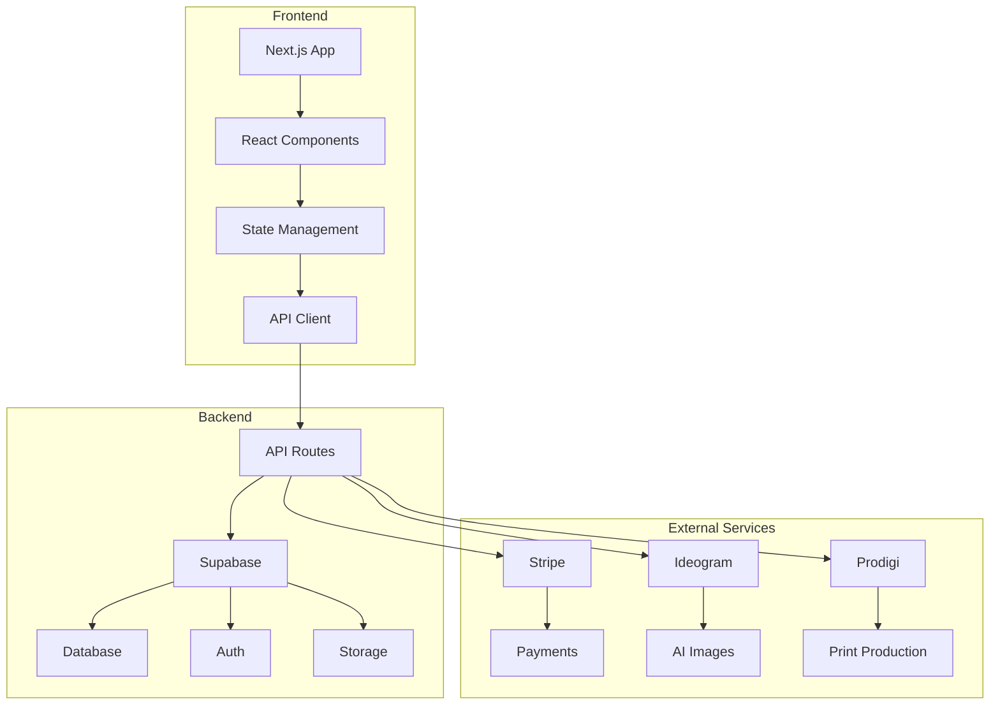

# Art Framer 🎨

> AI-powered art generation meets e-commerce - Create, customize, and order framed AI artwork delivered to your doorstep.

[](https://nextjs.org/)
[](https://www.typescriptlang.org/)
[](https://supabase.com/)
[](https://stripe.com/)
[](https://tailwindcss.com/)

## 🚀 Quick Start

### Prerequisites

- Node.js 18+
- npm or yarn
- Supabase account
- Stripe account
- Ideogram API key
- Prodigi API key

### Installation

1. **Clone the repository**

   ```bash
   git clone https://github.com/your-username/art-framer.git
   cd art-framer
   ```

2. **Install dependencies**

   ```bash
   npm install
   ```

3. **Set up environment variables**

   ```bash
   cp .env.example .env.local
   ```

   Fill in your environment variables:

   ```env
   # Supabase
   NEXT_PUBLIC_SUPABASE_URL=your_supabase_url
   NEXT_PUBLIC_SUPABASE_ANON_KEY=your_supabase_anon_key
   SUPABASE_SERVICE_ROLE_KEY=your_service_role_key

   # Stripe
   NEXT_PUBLIC_STRIPE_PUBLISHABLE_KEY=your_stripe_publishable_key
   STRIPE_SECRET_KEY=your_stripe_secret_key
   STRIPE_WEBHOOK_SECRET=your_webhook_secret

   # AI Image Generation
   IDEOGRAM_API_KEY=your_ideogram_api_key
   VEO_API_KEY=your_veo_api_key

   # Dropshipping
   PRODIGI_API_KEY=your_prodigi_api_key

   # Email
   RESEND_API_KEY=your_resend_api_key

   # App
   NEXT_PUBLIC_APP_URL=http://localhost:3000
   ```

4. **Set up the database**

   ```bash
   # Run the database migrations
   npm run db:migrate
   ```

5. **Start the development server**

   ```bash
   npm run dev
   ```

6. **Open your browser**
   Navigate to [http://localhost:3000](http://localhost:3000)

## 📚 Documentation

- **[Project Kickoff](./PROJECT_KICKOFF.md)** - Complete project overview, business model, and architecture
- **[Technical Architecture](./TECHNICAL_ARCHITECTURE.md)** - Detailed technical implementation guide
- **[Development Roadmap](./DEVELOPMENT_ROADMAP.md)** - Step-by-step development plan and timeline

## 🏗️ Architecture Overview



## 🎯 Key Features

### ✨ AI Art Generation

- **No-login required** - Start creating immediately
- **Multiple AI models** - Ideogram (primary), Veo (backup)
- **Real-time generation** - See your art come to life
- **Style customization** - Choose from various artistic styles

### 🖼️ Frame Customization

- **Three sizes** - Small (8x10"), Medium (12x16"), Large (16x20")
- **Frame styles** - Black, White, Natural wood
- **Real-time preview** - See how your art looks framed
- **Dynamic pricing** - Transparent pricing based on size

### 🛒 Seamless E-commerce

- **One-click ordering** - From generation to purchase
- **Secure payments** - Stripe-powered checkout
- **Order tracking** - Real-time updates on your order
- **Email notifications** - Keep informed every step

### 🚚 Dropshipping Integration

- **Zero inventory** - 100% dropshipping model
- **Global fulfillment** - Prodigi's worldwide network
- **Fast delivery** - Local production partners
- **Quality assurance** - Professional printing and framing

## 🛠️ Tech Stack

### Frontend

- **Next.js 14** - React framework with App Router
- **TypeScript** - Type-safe development
- **Tailwind CSS** - Utility-first styling
- **Framer Motion** - Smooth animations
- **Radix UI** - Accessible components
- **Zustand** - State management

### Backend

- **Supabase** - Database, Auth, and Storage
  - PostgreSQL database with real-time subscriptions
  - Built-in authentication and user management
  - File storage with CDN delivery and image optimization
- **Next.js API Routes** - Serverless functions
- **Stripe** - Payment processing
- **Ideogram API** - AI image generation
- **Prodigi API** - Print-on-demand

### DevOps

- **Vercel** - Hosting and deployment
- **GitHub** - Version control
- **Sentry** - Error tracking
- **Vercel Analytics** - Performance monitoring

## 📁 Project Structure

```
art-framer/
├── app/                    # Next.js App Router
│   ├── (auth)/            # Authentication pages
│   ├── (dashboard)/       # User dashboard
│   ├── api/               # API routes
│   ├── components/        # React components
│   └── globals.css        # Global styles
├── lib/                   # Utility libraries
│   ├── supabase/          # Database client
│   ├── stripe/            # Payment processing
│   ├── ai-image/          # AI generation
│   └── utils/             # Helper functions
├── public/                # Static assets
├── docs/                  # Documentation
└── README.md              # This file
```

## 🚀 Deployment

### Vercel (Recommended)

1. **Connect your repository**
   - Push your code to GitHub
   - Connect to Vercel
   - Configure environment variables

2. **Deploy**
   ```bash
   vercel --prod
   ```

### Manual Deployment

1. **Build the application**

   ```bash
   npm run build
   ```

2. **Start the production server**
   ```bash
   npm start
   ```

## 🧪 Testing

### Run Tests

```bash
# Unit tests
npm run test

# Integration tests
npm run test:integration

# E2E tests
npm run test:e2e
```

### Test Coverage

```bash
npm run test:coverage
```

## 📊 Monitoring

### Performance Metrics

- **Page Load Time**: <3 seconds
- **Image Generation**: <30 seconds
- **API Response**: <500ms
- **Uptime**: >99.9%

### Business Metrics

- **Conversion Rate**: >5%
- **Average Order Value**: $45-85
- **Customer Acquisition Cost**: <$20
- **Customer Lifetime Value**: >$150

## 🤝 Contributing

1. **Fork the repository**
2. **Create a feature branch**
   ```bash
   git checkout -b feature/amazing-feature
   ```
3. **Commit your changes**
   ```bash
   git commit -m 'Add amazing feature'
   ```
4. **Push to the branch**
   ```bash
   git push origin feature/amazing-feature
   ```
5. **Open a Pull Request**

## 📝 License

This project is licensed under the MIT License - see the [LICENSE](LICENSE) file for details.

## 🆘 Support

- **Documentation**: Check the docs folder
- **Issues**: [GitHub Issues](https://github.com/your-username/art-framer/issues)
- **Discussions**: [GitHub Discussions](https://github.com/your-username/art-framer/discussions)
- **Email**: support@artframer.com

## 🙏 Acknowledgments

- **Ideogram** - AI image generation
- **Prodigi** - Print-on-demand fulfillment
- **Stripe** - Payment processing
- **Supabase** - Backend infrastructure
- **Vercel** - Hosting and deployment

---

**Built with ❤️ by the Art Framer team**

[](https://github.com/your-username/art-framer)
[](https://github.com/your-username/art-framer)
[](https://github.com/your-username/art-framer/issues)
[](https://github.com/your-username/art-framer/blob/main/LICENSE)
