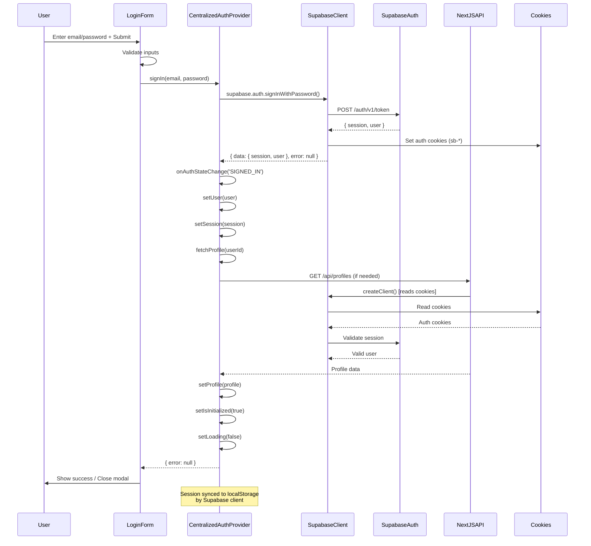
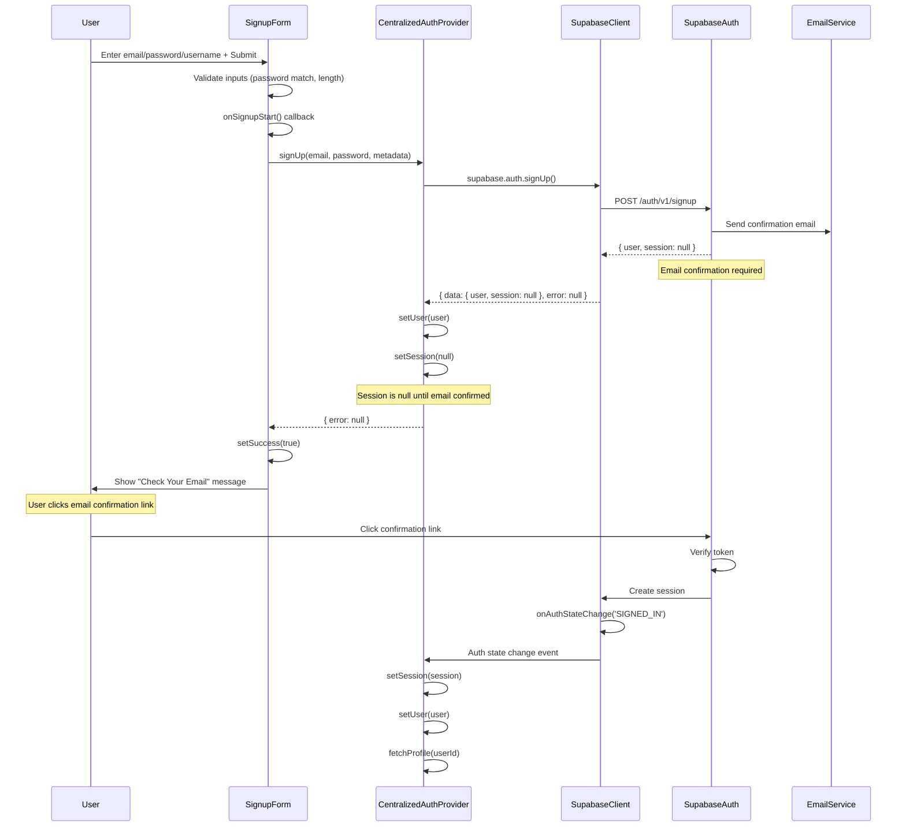
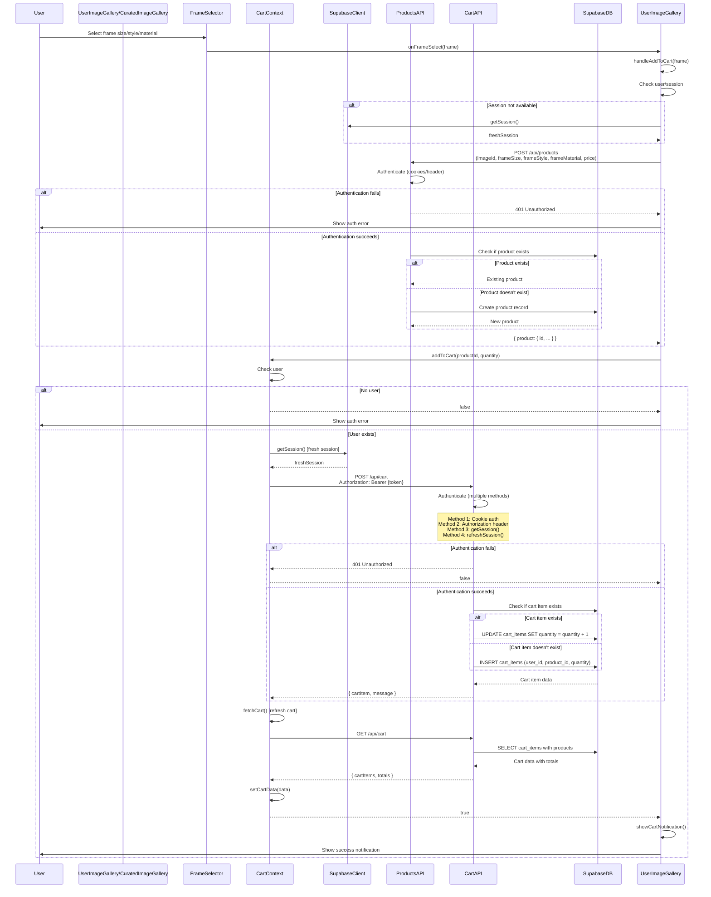
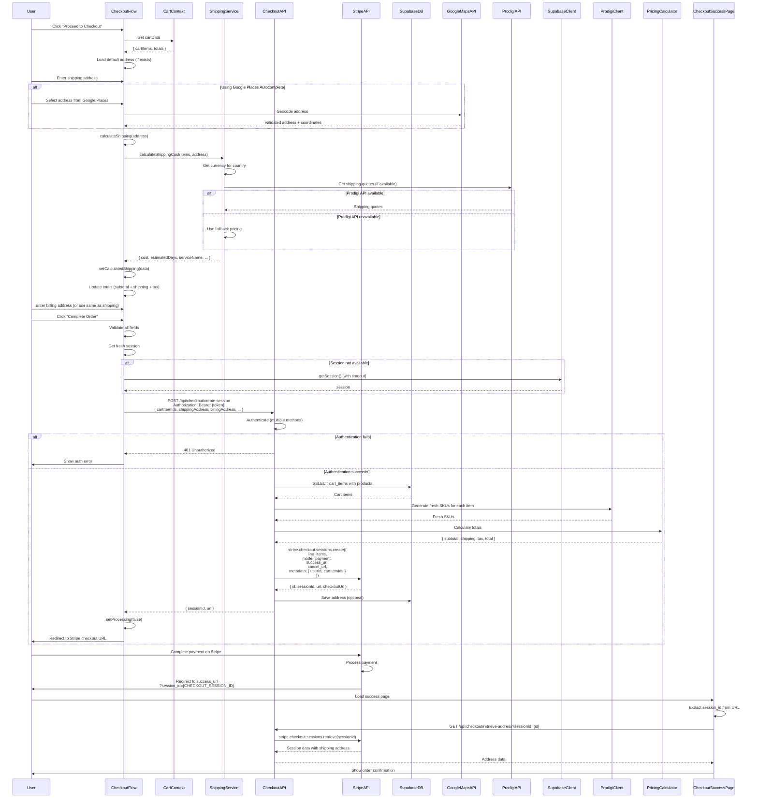
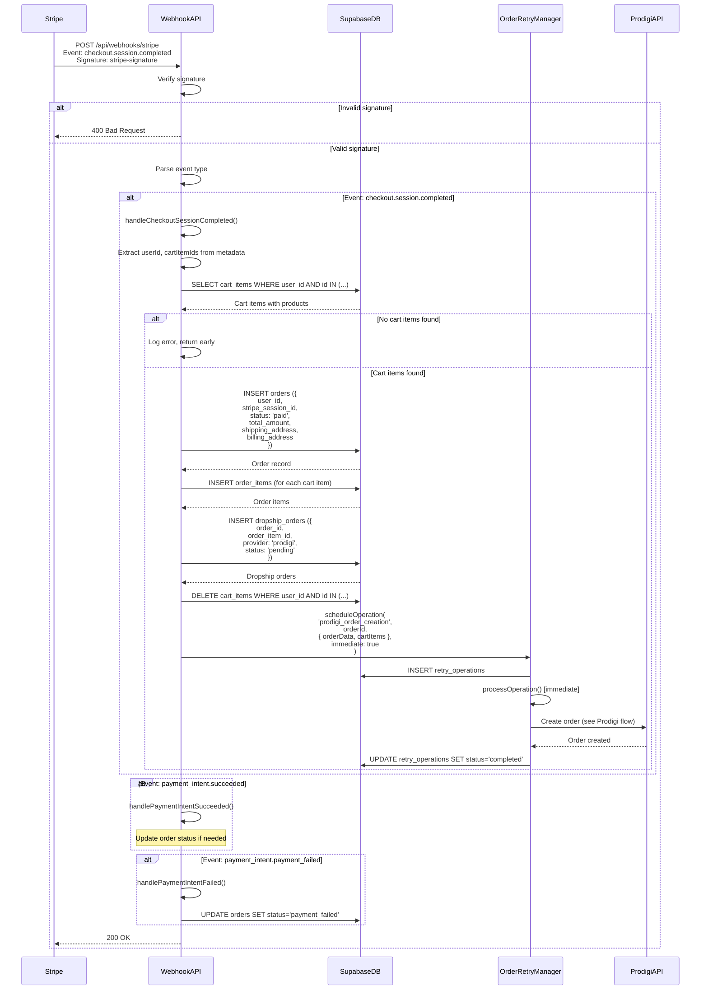
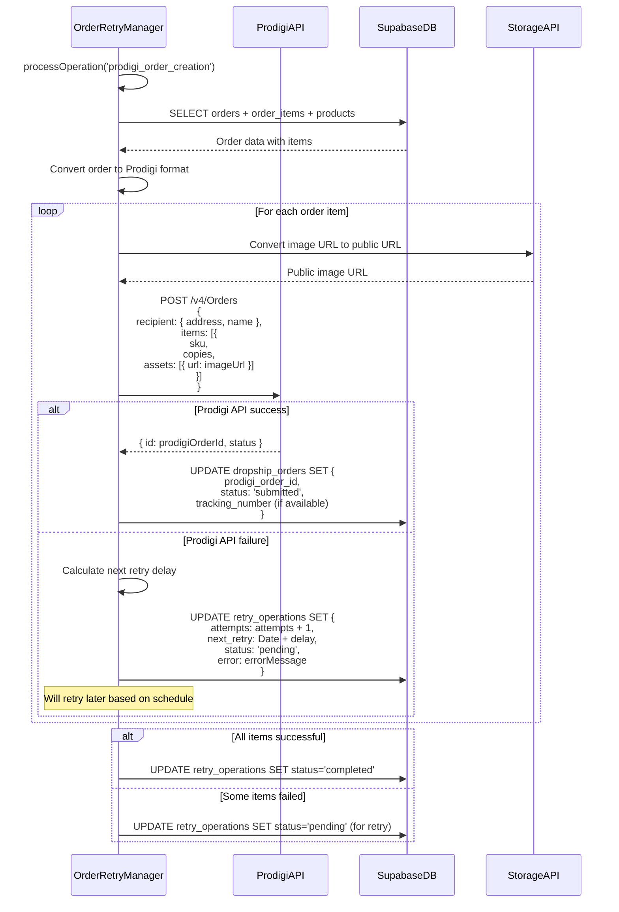
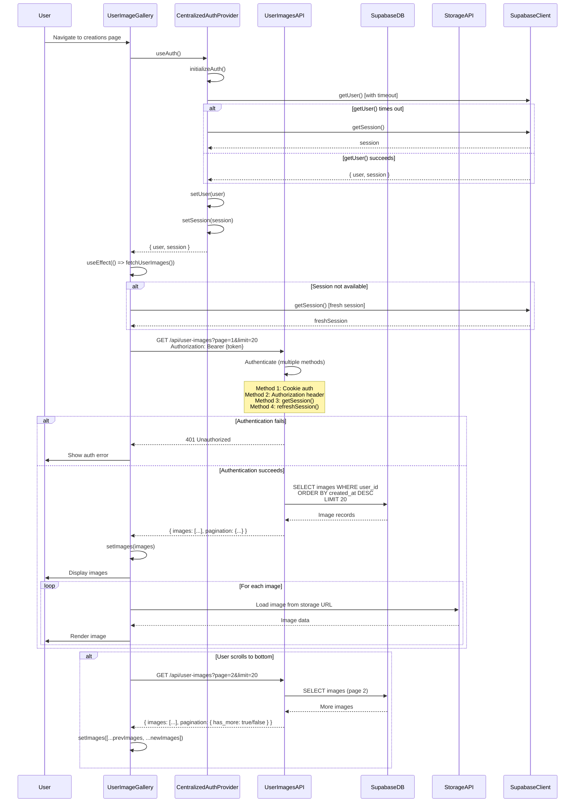

# Complete Sequence Diagrams - Art Framer Application

This document contains detailed sequence diagrams for all major flows in the application, showing every API call, state change, and interaction.

## Table of Contents

1. [User Login Flow](#1-user-login-flow)
2. [User Signup Flow](#2-user-signup-flow)
3. [Add to Cart Flow](#3-add-to-cart-flow)
4. [Checkout Flow (Complete)](#4-checkout-flow-complete)
5. [Stripe Webhook Processing](#5-stripe-webhook-processing)
6. [Prodigi Order Creation](#6-prodigi-order-creation)
7. [Image Loading Flow](#7-image-loading-flow)

---

## 1. User Login Flow

### Sequence Diagram

### Key Points:
- Cookies are set automatically by Supabase
- Session is synced to localStorage by Supabase client
- `onAuthStateChange` listener updates React state
- Profile is fetched after successful authentication

### Potential Issues:
1. **Cookie sync timing**: If cookies aren't synced to localStorage fast enough, subsequent API calls may fail
2. **Session initialization**: `initializeAuth()` runs on every page load, may conflict with login

---

## 2. User Signup Flow

### Sequence Diagram

### Key Points:
- Session is `null` until email is confirmed
- Profile creation may happen asynchronously
- User can't access protected routes until email confirmed

### Potential Issues:
1. **Email confirmation delay**: User may try to use app before confirming email
2. **Profile creation timing**: Profile might not exist when user first logs in

---

## 3. Add to Cart Flow

### Sequence Diagram

### Key Points:
- **Two-step process**: First create product, then add to cart
- **Fresh session**: Always gets fresh session before API calls
- **Multiple auth methods**: API tries multiple authentication methods
- **Cart refresh**: Cart is refreshed after adding item

### Potential Issues:
1. **Race condition**: If user clicks "Add to Cart" multiple times quickly, multiple API calls may be made
2. **Session timing**: If session expires between product creation and cart addition, cart API call fails
3. **Product creation failure**: If product creation fails, cart addition doesn't happen, but user might not see clear error

---

## 4. Checkout Flow (Complete)

### Sequence Diagram

### Key Points:
- **Shipping calculation**: Happens client-side before checkout
- **SKU regeneration**: Fresh SKUs generated at checkout time
- **Address validation**: Google Maps validates addresses
- **Multiple currencies**: Shipping costs converted to appropriate currency
- **Stripe redirect**: User is redirected to Stripe for payment

### Potential Issues:
1. **Shipping calculation timing**: If shipping calculation is slow, user may click checkout before it completes
2. **Session expiration**: Long checkout process may cause session to expire
3. **SKU generation failure**: If Prodigi API is down, checkout may fail
4. **Address validation**: Invalid addresses may cause shipping calculation to fail

---

## 5. Stripe Webhook Processing

### Sequence Diagram

### Key Points:
- **Signature verification**: Critical for security
- **Idempotency**: Webhook should be idempotent (handle duplicate events)
- **Order creation**: Order created in database immediately
- **Cart clearing**: Cart items deleted after order creation
- **Async Prodigi**: Prodigi order creation happens asynchronously via retry manager

### Potential Issues:
1. **Webhook delivery failure**: If webhook fails, order may not be created
2. **Duplicate events**: Stripe may send duplicate events, need idempotency
3. **Cart items already deleted**: If webhook runs twice, cart items may not exist
4. **Prodigi failure**: If Prodigi order creation fails, order exists but not fulfilled

---

## 6. Prodigi Order Creation

### Sequence Diagram

### Key Points:
- **Retry mechanism**: Failed orders are retried with exponential backoff
- **Image URL conversion**: Storage paths must be converted to public URLs
- **Per-item processing**: Each order item creates a separate Prodigi order
- **Status tracking**: Dropship order status updated in database

### Potential Issues:
1. **Image URL access**: If image URL is not publicly accessible, Prodigi order fails
2. **Prodigi API rate limits**: Too many requests may hit rate limits
3. **SKU mismatch**: If SKU doesn't exist in Prodigi, order fails
4. **Retry exhaustion**: If all retries fail, order is stuck in pending state

---

## 7. Image Loading Flow

### Sequence Diagram

### Key Points:
- **Multiple auth methods**: API tries multiple authentication methods
- **Session freshness**: Client gets fresh session if needed
- **Pagination**: Images loaded in pages of 20
- **Lazy loading**: Images loaded on scroll

### Potential Issues:
1. **Session timing**: If session expires during pagination, subsequent requests fail
2. **Cookie sync**: If cookies aren't synced, cookie-based auth fails
3. **Image loading errors**: If storage URL is invalid, images don't load
4. **Race conditions**: Multiple fetch requests may cause race conditions

---

## Common Issues and Solutions

### Issue 1: Authentication Failures
**Symptoms**: 401 errors on API calls
**Root Causes**:
- Cookies not synced to localStorage
- Session expired
- Authorization header not sent

**Solutions**:
- Always get fresh session before API calls
- Send Authorization header in addition to cookies
- Use multiple authentication fallback methods in API routes

### Issue 2: Race Conditions
**Symptoms**: Cart/orders in inconsistent state
**Root Causes**:
- Multiple simultaneous API calls
- State updates not synchronized

**Solutions**:
- Use loading states to prevent multiple simultaneous calls
- Implement proper error handling and rollback
- Use optimistic updates with error recovery

### Issue 3: Session Timing
**Symptoms**: Works sometimes, fails other times
**Root Causes**:
- Session expires during long operations
- Session not refreshed before API calls

**Solutions**:
- Always get fresh session before critical operations
- Implement session refresh mechanism
- Use shorter session timeouts or refresh tokens

### Issue 4: Webhook Failures
**Symptoms**: Orders created but not fulfilled
**Root Causes**:
- Webhook delivery failure
- Webhook processing error
- Prodigi order creation failure

**Solutions**:
- Implement retry mechanism for webhooks
- Add idempotency checks
- Monitor webhook delivery and processing

---

## Recommendations

1. **Add Request Deduplication**: Prevent duplicate API calls
2. **Implement Circuit Breaker**: Prevent cascading failures
3. **Add Comprehensive Logging**: Track all API calls and state changes
4. **Implement Health Checks**: Monitor system health
5. **Add Retry Logic**: Automatic retry for transient failures
6. **Optimize Session Management**: Reduce session refresh overhead
7. **Add Monitoring**: Track error rates and performance metrics

