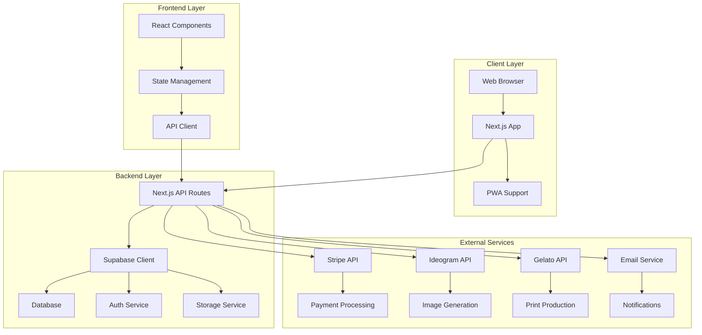

# Art Framer - Technical Architecture Document

## 🏗️ System Architecture Overview

### High-Level Architecture



## 🛠️ Technology Stack Details

### Frontend Architecture

#### Next.js 14 App Router Structure

```
app/
├── (auth)/
│   ├── login/
│   └── register/
├── (dashboard)/
│   ├── orders/
│   └── gallery/
├── api/
│   ├── auth/
│   ├── images/
│   ├── orders/
│   └── webhooks/
├── components/
│   ├── ui/
│   ├── forms/
│   └── layout/
├── lib/
│   ├── supabase/
│   ├── stripe/
│   └── utils/
└── globals.css
```

#### Key Dependencies

```json
{
  "dependencies": {
    "next": "^14.0.0",
    "react": "^18.0.0",
    "react-dom": "^18.0.0",
    "@supabase/supabase-js": "^2.38.0",
    "@stripe/stripe-js": "^2.1.0",
    "stripe": "^14.0.0",
    "zustand": "^4.4.0",
    "framer-motion": "^10.16.0",
    "@radix-ui/react-dialog": "^1.0.0",
    "@radix-ui/react-select": "^2.0.0",
    "class-variance-authority": "^0.7.0",
    "clsx": "^2.0.0",
    "tailwind-merge": "^2.0.0"
  },
  "devDependencies": {
    "@types/node": "^20.0.0",
    "@types/react": "^18.0.0",
    "typescript": "^5.0.0",
    "tailwindcss": "^3.3.0",
    "autoprefixer": "^10.4.0",
    "postcss": "^8.4.0",
    "eslint": "^8.0.0",
    "prettier": "^3.0.0"
  }
}
```

### Backend Architecture

#### Supabase Configuration

```typescript
// lib/supabase.ts
import { createClient } from "@supabase/supabase-js";

const supabaseUrl = process.env.NEXT_PUBLIC_SUPABASE_URL!;
const supabaseAnonKey = process.env.NEXT_PUBLIC_SUPABASE_ANON_KEY!;

export const supabase = createClient(supabaseUrl, supabaseAnonKey);

// Database types
export interface Database {
  public: {
    Tables: {
      users: {
        Row: {
          id: string;
          email: string;
          full_name: string | null;
          created_at: string;
          updated_at: string;
        };
        Insert: {
          id?: string;
          email: string;
          full_name?: string | null;
          created_at?: string;
          updated_at?: string;
        };
        Update: {
          id?: string;
          email?: string;
          full_name?: string | null;
          created_at?: string;
          updated_at?: string;
        };
      };
      images: {
        Row: {
          id: string;
          user_id: string | null;
          prompt: string;
          image_url: string;
          thumbnail_url: string;
          metadata: Json;
          created_at: string;
          is_public: boolean;
        };
        Insert: {
          id?: string;
          user_id?: string | null;
          prompt: string;
          image_url: string;
          thumbnail_url: string;
          metadata?: Json;
          created_at?: string;
          is_public?: boolean;
        };
        Update: {
          id?: string;
          user_id?: string | null;
          prompt?: string;
          image_url?: string;
          thumbnail_url?: string;
          metadata?: Json;
          created_at?: string;
          is_public?: boolean;
        };
      };
      // ... other tables
    };
  };
}
```

#### API Routes Structure

```typescript
// app/api/images/generate/route.ts
import { NextRequest, NextResponse } from "next/server";
import { ideogramClient } from "@/lib/ideogram";
import { storageService } from "@/lib/storage";
import { imageProcessingService } from "@/lib/image-processing";

export async function POST(request: NextRequest) {
  try {
    const { prompt, style, size } = await request.json();

    // Generate image using Ideogram
    const imageResult = await ideogramClient.generate({
      prompt,
      style,
      size: size || "1024x1024",
    });

    // Process and store image in Supabase Storage
    const { processedUrl, thumbnailUrl, metadata } =
      await imageProcessingService.processGeneratedImage(
        imageResult.url,
        prompt
      );

    // Save image metadata to database
    const { data: image, error } = await supabase
      .from("images")
      .insert({
        prompt,
        image_url: processedUrl, // Use Supabase Storage URL
        thumbnail_url: thumbnailUrl, // Use Supabase Storage thumbnail URL
        metadata: {
          ...metadata,
          style,
          size,
          provider: "ideogram",
          generation_id: imageResult.id,
          original_ai_url: imageResult.url, // Keep reference to original AI service URL
        },
      })
      .select()
      .single();

    if (error) throw error;

    return NextResponse.json({ success: true, image });
  } catch (error) {
    return NextResponse.json(
      { error: "Failed to generate image" },
      { status: 500 }
    );
  }
}
```

## 🔌 External API Integrations

### Supabase Storage Integration

#### Storage Configuration

````typescript
// lib/storage.ts
import { supabase } from './supabase'

export class StorageService {
  private bucketName = 'art-framer-images'

  async uploadImage(file: File, userId?: string): Promise<{
    url: string
    thumbnailUrl: string
    path: string
  }> {
    const fileExt = file.name.split('.').pop()
    const fileName = `${Date.now()}-${Math.random().toString(36).substring(2)}.${fileExt}`
    const filePath = userId ? `${userId}/${fileName}` : `public/${fileName}`

    // Upload original image
    const { data: uploadData, error: uploadError } = await supabase.storage
      .from(this.bucketName)
      .upload(filePath, file, {
        cacheControl: '3600',
        upsert: false
      })

    if (uploadError) throw uploadError

    // Get public URL
    const { data: { publicUrl } } = supabase.storage
      .from(this.bucketName)
      .getPublicUrl(filePath)

    // Generate thumbnail (you can use a service like Cloudinary or Sharp)
    const thumbnailUrl = await this.generateThumbnail(publicUrl, filePath)

    return {
      url: publicUrl,
      thumbnailUrl,
      path: filePath
    }
  }

  async generateThumbnail(originalUrl: string, filePath: string): Promise<string> {
    // For production, use a service like Cloudinary or Sharp
    // For now, we'll use the original URL with a query parameter
    const thumbnailPath = filePath.replace('.', '_thumb.')

    // You can implement actual thumbnail generation here
    // For example, using Sharp or a cloud service
    return originalUrl // Placeholder - implement actual thumbnail generation
  }

  async deleteImage(filePath: string): Promise<void> {
    const { error } = await supabase.storage
      .from(this.bucketName)
      .remove([filePath])

    if (error) throw error
  }

  async getImageUrl(filePath: string): Promise<string> {
    const { data: { publicUrl } } = supabase.storage
      .from(this.bucketName)
      .getPublicUrl(filePath)

    return publicUrl
  }
}

export const storageService = new StorageService()

#### Storage Optimization & CDN
```typescript
// lib/storage-optimization.ts
export class StorageOptimizationService {
  // Configure image transformations for different use cases
  getOptimizedImageUrl(originalUrl: string, options: {
    width?: number
    height?: number
    quality?: number
    format?: 'webp' | 'jpeg' | 'png'
  }): string {
    // Supabase Storage doesn't have built-in image transformations
    // For production, consider using:
    // 1. Cloudinary integration
    // 2. Sharp.js for server-side processing
    // 3. Next.js Image component with external loader

    const params = new URLSearchParams()
    if (options.width) params.append('w', options.width.toString())
    if (options.height) params.append('h', options.height.toString())
    if (options.quality) params.append('q', options.quality.toString())
    if (options.format) params.append('f', options.format)

    return `${originalUrl}?${params.toString()}`
  }

  // Generate different image sizes for responsive design
  async generateResponsiveImages(originalUrl: string): Promise<{
    small: string
    medium: string
    large: string
    original: string
  }> {
    return {
      small: this.getOptimizedImageUrl(originalUrl, { width: 400, quality: 80 }),
      medium: this.getOptimizedImageUrl(originalUrl, { width: 800, quality: 85 }),
      large: this.getOptimizedImageUrl(originalUrl, { width: 1200, quality: 90 }),
      original: originalUrl
    }
  }
}
````

#### Storage Bucket Setup

```sql
-- Create storage bucket for images
INSERT INTO storage.buckets (id, name, public)
VALUES ('art-framer-images', 'art-framer-images', true);

-- Set up storage policies
CREATE POLICY "Public Access" ON storage.objects
FOR SELECT USING (bucket_id = 'art-framer-images');

CREATE POLICY "Authenticated users can upload" ON storage.objects
FOR INSERT WITH CHECK (
  bucket_id = 'art-framer-images'
  AND auth.role() = 'authenticated'
);

CREATE POLICY "Users can update their own images" ON storage.objects
FOR UPDATE USING (
  bucket_id = 'art-framer-images'
  AND auth.uid()::text = (storage.foldername(name))[1]
);

CREATE POLICY "Users can delete their own images" ON storage.objects
FOR DELETE USING (
  bucket_id = 'art-framer-images'
  AND auth.uid()::text = (storage.foldername(name))[1]
);
```

#### Image Processing Pipeline

```typescript
// lib/image-processing.ts
export class ImageProcessingService {
  async processGeneratedImage(
    imageUrl: string,
    prompt: string
  ): Promise<{
    processedUrl: string;
    thumbnailUrl: string;
    metadata: any;
  }> {
    // Download image from AI service
    const response = await fetch(imageUrl);
    const imageBuffer = await response.arrayBuffer();

    // Upload to Supabase Storage
    const fileName = `generated-${Date.now()}.png`;
    const file = new File([imageBuffer], fileName, { type: "image/png" });

    const { url, thumbnailUrl, path } = await storageService.uploadImage(file);

    // Generate metadata
    const metadata = {
      originalUrl: imageUrl,
      prompt,
      processingDate: new Date().toISOString(),
      fileSize: imageBuffer.byteLength,
      dimensions: await this.getImageDimensions(imageBuffer),
    };

    return {
      processedUrl: url,
      thumbnailUrl,
      metadata,
    };
  }

  private async getImageDimensions(
    buffer: ArrayBuffer
  ): Promise<{ width: number; height: number }> {
    // Implement image dimension detection
    // You can use a library like 'image-size' or browser APIs
    return { width: 1024, height: 1024 }; // Default for now
  }
}
```

### AI Image Generation APIs

#### Ideogram API Integration

```typescript
// lib/ideogram.ts
export class IdeogramClient {
  private apiKey: string;
  private baseUrl = "https://api.ideogram.ai";

  constructor(apiKey: string) {
    this.apiKey = apiKey;
  }

  async generate(params: { prompt: string; style?: string; size?: string }) {
    const response = await fetch(`${this.baseUrl}/api/v1/generate`, {
      method: "POST",
      headers: {
        Authorization: `Bearer ${this.apiKey}`,
        "Content-Type": "application/json",
      },
      body: JSON.stringify({
        prompt: params.prompt,
        style: params.style || "photographic",
        size: params.size || "1024x1024",
        quality: "high",
      }),
    });

    if (!response.ok) {
      throw new Error("Failed to generate image");
    }

    return response.json();
  }
}

export const ideogramClient = new IdeogramClient(process.env.IDEOGRAM_API_KEY!);
```

#### Veo API Integration (Backup)

```typescript
// lib/veo.ts
export class VeoClient {
  private apiKey: string;
  private baseUrl = "https://api.veo.ai";

  constructor(apiKey: string) {
    this.apiKey = apiKey;
  }

  async generate(params: { prompt: string; style?: string; size?: string }) {
    const response = await fetch(`${this.baseUrl}/v1/images/generations`, {
      method: "POST",
      headers: {
        Authorization: `Bearer ${this.apiKey}`,
        "Content-Type": "application/json",
      },
      body: JSON.stringify({
        prompt: params.prompt,
        style: params.style || "realistic",
        size: params.size || "1024x1024",
      }),
    });

    if (!response.ok) {
      throw new Error("Failed to generate image with Veo");
    }

    return response.json();
  }
}
```

### Dropshipping API Integrations

#### Gelato API Integration

```typescript
// lib/gelato.ts
export class GelatoClient {
  private apiKey: string;
  private baseUrl = "https://api.gelato.com";

  constructor(apiKey: string) {
    this.apiKey = apiKey;
  }

  async createOrder(params: {
    imageUrl: string;
    frameSize: string;
    frameStyle: string;
    quantity: number;
    shippingAddress: any;
  }) {
    const response = await fetch(`${this.baseUrl}/v1/orders`, {
      method: "POST",
      headers: {
        Authorization: `Bearer ${this.apiKey}`,
        "Content-Type": "application/json",
      },
      body: JSON.stringify({
        items: [
          {
            productUid: this.getProductUid(params.frameSize, params.frameStyle),
            quantity: params.quantity,
            imageUrl: params.imageUrl,
          },
        ],
        shippingAddress: params.shippingAddress,
        currency: "USD",
      }),
    });

    if (!response.ok) {
      throw new Error("Failed to create Gelato order");
    }

    return response.json();
  }

  private getProductUid(size: string, style: string): string {
    // Map frame size and style to Gelato product UIDs
    const productMap = {
      "small-black": "gelato-frame-small-black",
      "small-white": "gelato-frame-small-white",
      "medium-black": "gelato-frame-medium-black",
      "medium-white": "gelato-frame-medium-white",
      "large-black": "gelato-frame-large-black",
      "large-white": "gelato-frame-large-white",
    };

    return productMap[`${size}-${style}`] || "gelato-frame-medium-black";
  }
}
```

### Payment Processing

#### Stripe Integration

```typescript
// lib/stripe.ts
import Stripe from "stripe";

export const stripe = new Stripe(process.env.STRIPE_SECRET_KEY!, {
  apiVersion: "2023-10-16",
});

export async function createPaymentIntent(amount: number, metadata: any) {
  return stripe.paymentIntents.create({
    amount: Math.round(amount * 100), // Convert to cents
    currency: "usd",
    metadata,
    automatic_payment_methods: {
      enabled: true,
    },
  });
}

export async function createCheckoutSession(params: {
  lineItems: any[];
  successUrl: string;
  cancelUrl: string;
  metadata?: any;
}) {
  return stripe.checkout.sessions.create({
    payment_method_types: ["card"],
    line_items: params.lineItems,
    mode: "payment",
    success_url: params.successUrl,
    cancel_url: params.cancelUrl,
    metadata: params.metadata,
  });
}
```

## 🗄️ Database Schema & Migrations

### Complete Database Schema

```sql
-- Enable UUID extension
CREATE EXTENSION IF NOT EXISTS "uuid-ossp";

-- Users table
CREATE TABLE users (
  id UUID PRIMARY KEY DEFAULT uuid_generate_v4(),
  email VARCHAR(255) UNIQUE NOT NULL,
  full_name VARCHAR(255),
  avatar_url TEXT,
  created_at TIMESTAMP WITH TIME ZONE DEFAULT NOW(),
  updated_at TIMESTAMP WITH TIME ZONE DEFAULT NOW()
);

-- Images table
CREATE TABLE images (
  id UUID PRIMARY KEY DEFAULT uuid_generate_v4(),
  user_id UUID REFERENCES users(id) ON DELETE SET NULL,
  prompt TEXT NOT NULL,
  image_url TEXT NOT NULL,
  thumbnail_url TEXT NOT NULL,
  metadata JSONB DEFAULT '{}',
  created_at TIMESTAMP WITH TIME ZONE DEFAULT NOW(),
  is_public BOOLEAN DEFAULT false,
  generation_status VARCHAR(50) DEFAULT 'pending'
);

-- Products table (framed images)
CREATE TABLE products (
  id UUID PRIMARY KEY DEFAULT uuid_generate_v4(),
  image_id UUID REFERENCES images(id) ON DELETE CASCADE,
  frame_size VARCHAR(50) NOT NULL CHECK (frame_size IN ('small', 'medium', 'large')),
  frame_style VARCHAR(50) NOT NULL CHECK (frame_style IN ('black', 'white', 'natural')),
  price DECIMAL(10,2) NOT NULL,
  status VARCHAR(50) DEFAULT 'active' CHECK (status IN ('active', 'inactive')),
  created_at TIMESTAMP WITH TIME ZONE DEFAULT NOW()
);

-- Orders table
CREATE TABLE orders (
  id UUID PRIMARY KEY DEFAULT uuid_generate_v4(),
  user_id UUID REFERENCES users(id) ON DELETE SET NULL,
  stripe_payment_intent VARCHAR(255) UNIQUE,
  status VARCHAR(50) DEFAULT 'pending' CHECK (status IN ('pending', 'paid', 'processing', 'shipped', 'delivered', 'cancelled')),
  shipping_address JSONB NOT NULL,
  billing_address JSONB,
  subtotal DECIMAL(10,2) NOT NULL,
  tax_amount DECIMAL(10,2) DEFAULT 0,
  shipping_amount DECIMAL(10,2) DEFAULT 0,
  total_amount DECIMAL(10,2) NOT NULL,
  currency VARCHAR(3) DEFAULT 'USD',
  created_at TIMESTAMP WITH TIME ZONE DEFAULT NOW(),
  updated_at TIMESTAMP WITH TIME ZONE DEFAULT NOW()
);

-- Order items table
CREATE TABLE order_items (
  id UUID PRIMARY KEY DEFAULT uuid_generate_v4(),
  order_id UUID REFERENCES orders(id) ON DELETE CASCADE,
  product_id UUID REFERENCES products(id) ON DELETE CASCADE,
  quantity INTEGER NOT NULL DEFAULT 1,
  unit_price DECIMAL(10,2) NOT NULL,
  total_price DECIMAL(10,2) NOT NULL
);

-- Dropshipping orders table
CREATE TABLE dropship_orders (
  id UUID PRIMARY KEY DEFAULT uuid_generate_v4(),
  order_id UUID REFERENCES orders(id) ON DELETE CASCADE,
  supplier VARCHAR(50) NOT NULL CHECK (supplier IN ('gelato', 'prodigi', 'printful')),
  supplier_order_id VARCHAR(255),
  status VARCHAR(50) DEFAULT 'pending',
  tracking_number VARCHAR(255),
  estimated_delivery DATE,
  created_at TIMESTAMP WITH TIME ZONE DEFAULT NOW(),
  updated_at TIMESTAMP WITH TIME ZONE DEFAULT NOW()
);

-- Create indexes for performance
CREATE INDEX idx_images_user_id ON images(user_id);
CREATE INDEX idx_images_created_at ON images(created_at);
CREATE INDEX idx_products_image_id ON products(image_id);
CREATE INDEX idx_orders_user_id ON orders(user_id);
CREATE INDEX idx_orders_status ON orders(status);
CREATE INDEX idx_order_items_order_id ON order_items(order_id);
CREATE INDEX idx_dropship_orders_order_id ON dropship_orders(order_id);

-- Create updated_at trigger function
CREATE OR REPLACE FUNCTION update_updated_at_column()
RETURNS TRIGGER AS $$
BEGIN
    NEW.updated_at = NOW();
    RETURN NEW;
END;
$$ language 'plpgsql';

-- Apply triggers
CREATE TRIGGER update_users_updated_at BEFORE UPDATE ON users FOR EACH ROW EXECUTE FUNCTION update_updated_at_column();
CREATE TRIGGER update_orders_updated_at BEFORE UPDATE ON orders FOR EACH ROW EXECUTE FUNCTION update_updated_at_column();
CREATE TRIGGER update_dropship_orders_updated_at BEFORE UPDATE ON dropship_orders FOR EACH ROW EXECUTE FUNCTION update_updated_at_column();
```

## 🔐 Security & Authentication

### Authentication Flow

```typescript
// lib/auth.ts
import { supabase } from "./supabase";

export class AuthService {
  async signUp(email: string, password: string, fullName?: string) {
    const { data, error } = await supabase.auth.signUp({
      email,
      password,
      options: {
        data: {
          full_name: fullName,
        },
      },
    });

    if (error) throw error;
    return data;
  }

  async signIn(email: string, password: string) {
    const { data, error } = await supabase.auth.signInWithPassword({
      email,
      password,
    });

    if (error) throw error;
    return data;
  }

  async signOut() {
    const { error } = await supabase.auth.signOut();
    if (error) throw error;
  }

  async getCurrentUser() {
    const {
      data: { user },
      error,
    } = await supabase.auth.getUser();
    if (error) throw error;
    return user;
  }
}
```

### API Route Protection

```typescript
// lib/middleware.ts
import { createMiddlewareClient } from "@supabase/auth-helpers-nextjs";
import { NextResponse } from "next/server";
import type { NextRequest } from "next/server";

export async function middleware(req: NextRequest) {
  const res = NextResponse.next();
  const supabase = createMiddlewareClient({ req, res });

  const {
    data: { session },
  } = await supabase.auth.getSession();

  // Protect API routes that require authentication
  if (req.nextUrl.pathname.startsWith("/api/orders") && !session) {
    return NextResponse.json({ error: "Unauthorized" }, { status: 401 });
  }

  return res;
}

export const config = {
  matcher: ["/api/orders/:path*", "/dashboard/:path*"],
};
```

## 🚀 Deployment & DevOps

### Environment Variables

```bash
# .env.local
NEXT_PUBLIC_SUPABASE_URL=your_supabase_url
NEXT_PUBLIC_SUPABASE_ANON_KEY=your_supabase_anon_key
SUPABASE_SERVICE_ROLE_KEY=your_service_role_key

NEXT_PUBLIC_STRIPE_PUBLISHABLE_KEY=your_stripe_publishable_key
STRIPE_SECRET_KEY=your_stripe_secret_key
STRIPE_WEBHOOK_SECRET=your_webhook_secret

IDEOGRAM_API_KEY=your_ideogram_api_key
VEO_API_KEY=your_veo_api_key

GELATO_API_KEY=your_gelato_api_key
PRODIGI_API_KEY=your_prodigi_api_key

RESEND_API_KEY=your_resend_api_key

NEXT_PUBLIC_APP_URL=http://localhost:3000
```

### Vercel Configuration

```json
// vercel.json
{
  "buildCommand": "npm run build",
  "outputDirectory": ".next",
  "framework": "nextjs",
  "installCommand": "npm install",
  "env": {
    "NEXT_PUBLIC_SUPABASE_URL": "@supabase_url",
    "NEXT_PUBLIC_SUPABASE_ANON_KEY": "@supabase_anon_key",
    "SUPABASE_SERVICE_ROLE_KEY": "@supabase_service_role_key",
    "NEXT_PUBLIC_STRIPE_PUBLISHABLE_KEY": "@stripe_publishable_key",
    "STRIPE_SECRET_KEY": "@stripe_secret_key",
    "STRIPE_WEBHOOK_SECRET": "@stripe_webhook_secret",
    "IDEOGRAM_API_KEY": "@ideogram_api_key",
    "VEO_API_KEY": "@veo_api_key",
    "GELATO_API_KEY": "@gelato_api_key",
    "PRODIGI_API_KEY": "@prodigi_api_key",
    "RESEND_API_KEY": "@resend_api_key"
  }
}
```

### CI/CD Pipeline

```yaml
# .github/workflows/deploy.yml
name: Deploy to Vercel

on:
  push:
    branches: [main]
  pull_request:
    branches: [main]

jobs:
  deploy:
    runs-on: ubuntu-latest

    steps:
      - uses: actions/checkout@v3

      - name: Setup Node.js
        uses: actions/setup-node@v3
        with:
          node-version: "18"
          cache: "npm"

      - name: Install dependencies
        run: npm ci

      - name: Run tests
        run: npm test

      - name: Build application
        run: npm run build
        env:
          NEXT_PUBLIC_SUPABASE_URL: ${{ secrets.NEXT_PUBLIC_SUPABASE_URL }}
          NEXT_PUBLIC_SUPABASE_ANON_KEY: ${{ secrets.NEXT_PUBLIC_SUPABASE_ANON_KEY }}
          NEXT_PUBLIC_STRIPE_PUBLISHABLE_KEY: ${{ secrets.NEXT_PUBLIC_STRIPE_PUBLISHABLE_KEY }}

      - name: Deploy to Vercel
        uses: amondnet/vercel-action@v25
        with:
          vercel-token: ${{ secrets.VERCEL_TOKEN }}
          vercel-org-id: ${{ secrets.VERCEL_ORG_ID }}
          vercel-project-id: ${{ secrets.VERCEL_PROJECT_ID }}
          vercel-args: "--prod"
```

## 📊 Monitoring & Analytics

### Error Tracking

```typescript
// lib/error-tracking.ts
import * as Sentry from "@sentry/nextjs";

Sentry.init({
  dsn: process.env.NEXT_PUBLIC_SENTRY_DSN,
  environment: process.env.NODE_ENV,
  tracesSampleRate: 1.0,
});

export function captureError(error: Error, context?: any) {
  Sentry.captureException(error, {
    extra: context,
  });
}
```

### Performance Monitoring

```typescript
// lib/analytics.ts
export function trackEvent(eventName: string, properties?: any) {
  // Vercel Analytics
  if (typeof window !== "undefined" && window.va) {
    window.va.track(eventName, properties);
  }

  // Custom analytics
  fetch("/api/analytics", {
    method: "POST",
    headers: { "Content-Type": "application/json" },
    body: JSON.stringify({ event: eventName, properties }),
  });
}
```

## 🧪 Testing Strategy

### Unit Tests

```typescript
// __tests__/lib/ideogram.test.ts
import { IdeogramClient } from "@/lib/ideogram";

describe("IdeogramClient", () => {
  let client: IdeogramClient;

  beforeEach(() => {
    client = new IdeogramClient("test-api-key");
  });

  it("should generate image successfully", async () => {
    const mockResponse = {
      id: "test-id",
      url: "https://example.com/image.jpg",
      thumbnail_url: "https://example.com/thumb.jpg",
    };

    global.fetch = jest.fn().mockResolvedValue({
      ok: true,
      json: () => Promise.resolve(mockResponse),
    });

    const result = await client.generate({
      prompt: "A beautiful sunset",
      style: "photographic",
    });

    expect(result).toEqual(mockResponse);
  });
});
```

### Integration Tests

```typescript
// __tests__/api/images/generate.test.ts
import { createMocks } from "node-mocks-http";
import { POST } from "@/app/api/images/generate/route";

describe("/api/images/generate", () => {
  it("should generate image and save to database", async () => {
    const { req, res } = createMocks({
      method: "POST",
      body: {
        prompt: "A beautiful sunset",
        style: "photographic",
      },
    });

    await POST(req);

    expect(res._getStatusCode()).toBe(200);
    const data = JSON.parse(res._getData());
    expect(data.success).toBe(true);
    expect(data.image).toBeDefined();
  });
});
```

---

**Document Version**: 1.0  
**Last Updated**: December 2024  
**Next Review**: Before development phase
